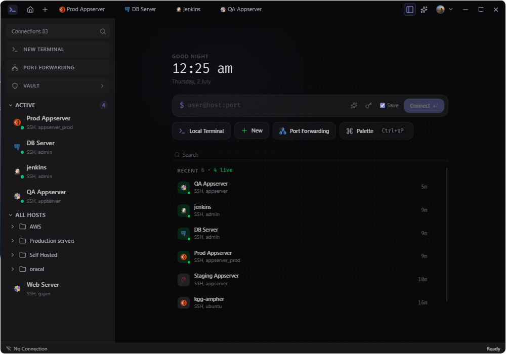

<div align="center">
  <br />
  
  <br /><br />

  <p>
    <a href="https://opensource.org/licenses/MIT"></a>&nbsp;
    <a href="https://github.com/zync-sh/zync/releases"></a>&nbsp;
    <a href="https://github.com/zync-sh/zync/releases"></a>&nbsp;
    <a href="https://github.com/zync-sh/zync"></a>
  </p>

  <p>
    <a href="https://zync.thesudoer.in">Website</a>&nbsp;&nbsp;•&nbsp;&nbsp;
    <a href="https://github.com/zync-sh/zync/releases">Releases</a>&nbsp;&nbsp;•&nbsp;&nbsp;
    <a href="#why-zync">Why Zync</a>&nbsp;&nbsp;•&nbsp;&nbsp;
    <a href="#local-terminal">Local terminal</a>&nbsp;&nbsp;•&nbsp;&nbsp;
    <a href="#your-data">Your data</a>&nbsp;&nbsp;•&nbsp;&nbsp;
    <a href="#how-zync-compares">Compare</a>&nbsp;&nbsp;•&nbsp;&nbsp;
    <a href="#highlights">Highlights</a>&nbsp;&nbsp;•&nbsp;&nbsp;
    <a href="#installation">Installation</a>&nbsp;&nbsp;•&nbsp;&nbsp;
    <a href="#documentation">Documentation</a>&nbsp;&nbsp;•&nbsp;&nbsp;
    <a href="#for-developers">Developers</a>&nbsp;&nbsp;•&nbsp;&nbsp;
    <a href="#extensions">Extensions</a>&nbsp;&nbsp;•&nbsp;&nbsp;
    <a href="#contributing">Contributing</a>&nbsp;&nbsp;•&nbsp;&nbsp;
    <a href="#support-zync">Support</a>
  </p>
  <br />
</div>

---

**Zync** is a fast, native **SSH workspace** for developers and ops: connections, terminals, files, vault, sync, and AI in one desktop app. Built with **Rust** and **Tauri**, it stays light on resources while giving you a full remote workflow without juggling separate tools.

Manage hosts from a persistent sidebar, keep shells alive while you switch panels, and pick up exactly where you left off after a restart.

## Why Zync

**One native workspace for everything you do over SSH.** Connections, terminals, SFTP, tunnels, vault, and sync. Native, fast, and designed so **you own your data**.

- **One app for the whole workflow:** connections, terminals, files, tunnels, vault, and snippets in a persistent sidebar
- **A terminal you can use before you add hosts:** local shells and remote SSH share the same stack ([Local terminal](#local-terminal))
- **Your data stays yours:** no Zync server for hosts or credentials; optional encrypted sync goes to your own cloud ([Your data](#your-data))
- **Open source:** MIT licensed, built in public; ideas and contributions welcome ([Contributing](#contributing))

Everyday infra work should feel fast, clear, and under your control.

<p align="center">
  
</p>

## Local terminal

**Local shells and remote SSH in one app.**

Zync is a full desktop terminal before it is an SSH client. Install it, open the app, and run commands on your own machine. No hosts, no keys, and no remote setup required.

- **Windows:** pick PowerShell, Command Prompt, Git Bash, or any WSL distro in Settings → Terminal
- **Linux & macOS:** your system shell is ready on first launch
- **One terminal stack:** GPU-accelerated rendering, themes, font ligatures, ghost suggestions, search, multi-tab shells, and session restore

When you add SSH hosts later, local and remote sessions share the same workspace, sidebar, and terminal experience. Use Zync as your daily driver on your laptop, then connect to production when you need to.

## Your data

**You own your workspace data.** Zync is a **desktop app**, not a hosted SSH service. We do **not** store your hosts, credentials, terminal sessions, or workspace on Zync servers.

| Where it lives | What that means |
|----------------|-----------------|
| **Your machine** | Hosts, tunnels, snippets, and settings are saved locally in your Zync data folder |
| **Encrypted Vault** | Passwords and keys can stay in an on-device vault; only you hold the passphrase and recovery key |
| **Your cloud account** | Optional sync backs up to **your** Google Drive (`drive.appdata`). Collections are encrypted before upload. Zync never keeps a copy in our infrastructure |

No Zync account is required to use the app. Install it, work offline, unlock the vault when you need secrets, and turn on sync only if you want encrypted backup across your own devices.

**Roadmap:** additional cloud providers for personal multi-device sync, plus an optional **self-hosted team backend** for orgs that want shared sync without sending credentials to Zync infrastructure. Today ships with Google Drive; team hosting is not available yet.

Details: [docs/SECURITY.md](docs/SECURITY.md)

## How Zync compares

Why pick Zync over Termius, VS Code Remote SSH, or MobaXterm? Each tool optimizes for a different job. Zync targets a **single desktop workspace** for day-to-day SSH ops: hosts, terminals, files, tunnels, vault, and sync together.

Comparisons reflect each product's typical use today, not every paid tier or plugin. Free-plan limits are noted in **bold**.

| Feature | Zync | Termius | VS Code Remote SSH | MobaXterm |
|---------|------|---------|-------------------|-----------|
| **Platforms** | Linux, Windows, macOS | Linux, Windows, macOS, iOS, Android | Where VS Code runs | Windows-first (official) |
| **Files** | SFTP manager + in-app editor | SFTP client | Remote explorer in the IDE | SFTP browser + editor |
| **Vault** | On-device encrypted vault | **Local vault on free**; cloud/team vault needs paid plan | SSH keys / system agent | Local saved sessions (master password) |
| **Sync** | Your cloud (Google Drive; encrypted) | **No cross-device sync on free**; Termius cloud on paid | None (local workspace) | None (local sessions) |
| **Open Source** | MIT | No | VS Code is OSS; Remote SSH is a Microsoft extension | Proprietary (free Home + paid Pro) |
| **Pricing** | Free (MIT, no subscription) | Free Starter (**no sync/snippets/cloud vault**); Pro from ~$10/mo (annual) | Free (VS Code + Remote SSH extension) | Free Home (**12 sessions, 2 tunnels**); Pro ~$69/user/year with **perpetual license** (updates optional) |
| **Best Fit** | One native desktop app for SSH, files, vault, and tunnels without a vendor-owned workspace | Mobile + cross-device sync inside the Termius platform | Editing and debugging code as a full IDE remote session | Windows-heavy workflows with X11 and classic session tooling |

See vendor websites for current pricing and plan details.

**Rule of thumb:**

- **VS Code Remote SSH** → IDE-first workflows
- **MobaXterm** → Windows + X11 workflows
- **Termius** → Mobile and cloud-sync workflows
- **Zync** → Native SSH workspace with local-first data ownership

## Highlights

### Connect

- SSH with key or password auth, **jump hosts**, and connection folders
- **SSH config import** and visual **tunnel** + **port forwarding** management
- Jump from **local shells** to remote sessions in the same app (see [Local terminal](#local-terminal))

### Work

- **xterm 6** terminal with WebGL/DOM rendering, multi-tab shells, optional idle suspend, and **ghost suggestions**
- **SFTP file manager** with drag-and-drop and an in-app **CodeMirror 6** editor
- **Dashboard**, **snippets**, and **session persistence** (tabs, terminals, working directory)

### Secure

- **Your data stays on your devices.** No Zync-hosted workspace; see [Your data](#your-data)
- Encrypted **Vault** for credentials: recovery key, revision history, OS keychain remember-unlock
- **Google Drive sync** to *your* account: encrypted hosts, tunnels, snippets, and settings (Sync & Backup workspace)

### Extend

- **AI sidebar** (Ctrl+I): **Ask** and **Agent** modes with terminal context
- **Plugin marketplace:** feature plugins, themes, icon themes, and editor providers
- Command palette (⌘K / Ctrl+K), rich shortcuts, auto-updates, cross-platform packages

## Installation

Download the latest build from the [Releases page](https://github.com/zync-sh/zync/releases), or follow the platform steps below. Full guide: [zync.thesudoer.in/docs/installation](https://zync.thesudoer.in/docs/installation).

| Platform | Format |
|----------|--------|
| Linux | `.deb`, `.rpm`, `.AppImage`, `.tar.gz` |
| Windows | `.exe` |
| macOS | `.dmg` |

### Linux

#### One-line install (AppImage)

The install script downloads the latest AppImage, installs to `~/.local/share/zync/`, adds `~/.local/bin/zync`, and registers a desktop entry. No `sudo` required (x86_64 only).

```bash
curl -fsSL https://zync.thesudoer.in/install.sh | sh
```

To remove an AppImage install placed by the script:

```bash
curl -fsSL https://zync.thesudoer.in/uninstall.sh | sh
```

#### Debian / Ubuntu (APT repository)

Recommended on Debian-based distros. Keeps Zync updated with `apt upgrade` alongside your system packages.

```bash
# 1. Prepare the APT keyring directory (missing on minimal installs)
sudo install -m 0755 -d /etc/apt/keyrings

# 2. Add the GPG key
curl -fsSL https://apt.zync.thesudoer.in/key.gpg | sudo gpg --dearmor -o /etc/apt/keyrings/zync.gpg
sudo chmod a+r /etc/apt/keyrings/zync.gpg

# 3. Add the repository
echo "deb [signed-by=/etc/apt/keyrings/zync.gpg] https://apt.zync.thesudoer.in stable main" | sudo tee /etc/apt/sources.list.d/zync.list

# 4. Update and install
sudo apt update && sudo apt install zync
```

**Upgrade later:** `sudo apt update && sudo apt install --only-upgrade zync` (or `sudo apt upgrade`).

**Remove:** `sudo apt remove zync`. To drop the repo as well: `sudo rm /etc/apt/sources.list.d/zync.list /etc/apt/keyrings/zync.gpg`.

**Manual .deb:** `sudo dpkg -i zync_*.deb` then `sudo apt-get install -f` if dependencies are missing.

**Minimal distros:** if Zync fails to start, install WebKit/GTK deps: `sudo apt install libwebkit2gtk-4.1-0 libgtk-3-0`.

### Windows & macOS

- **Windows:** run the `.exe` installer from [Releases](https://github.com/zync-sh/zync/releases).
- **macOS:** open the `.dmg` and drag Zync to Applications.

### First run

1. Install Zync and launch the app.
2. **Start working:** open a **local terminal** from the welcome screen, or **add a connection** (import `~/.ssh/config`, use the connection wizard, or create a host manually).
3. Open **Terminal**, **Files**, or **Dashboard** from a host tab. Your workspace restores on the next launch.

## Workspace overview

- **Sidebar:** hosts, folders, Vault, Sync & Backup, snippets, and release notes as first-class tabs
- **Host panels:** Terminal, Files, Dashboard, Tunnels, Port Forwarding; shells stay alive when you switch
- **Settings:** General, Terminal, Appearance, File Manager, AI, Shortcuts, Plugins, About (+ in-app `settings.json` editor)

## Documentation

**User guides & install help:** [zync.thesudoer.in/docs](https://zync.thesudoer.in/docs)

**Repository docs** (architecture and implementation):

| Document | Covers |
|----------|--------|
| [docs/SECURITY.md](docs/SECURITY.md) | Vault, sync, OAuth, and operator security guidance |
| [docs/VAULT.md](docs/VAULT.md) | Vault, credentials, Google sync |
| [docs/TERMINAL.md](docs/TERMINAL.md) | Terminal system (IPC, renderer, lifecycle, settings) |
| [docs/TERMINAL_GHOST.md](docs/TERMINAL_GHOST.md) | Ghost completions (inline, history, paths, suggestion engine) |
| [docs/TUNNELS.md](docs/TUNNELS.md) | Port forwarding (local/remote, auto-start, sync, roadmap) |
| [docs/SESSION_PERSISTENCE.md](docs/SESSION_PERSISTENCE.md) | Tab and terminal restore across restarts |
| [docs/SETTINGS_SYSTEM.md](docs/SETTINGS_SYSTEM.md) | Global settings and `settings.json` |

## For developers

### Tech stack

| Layer | Technologies |
|-------|--------------|
| **Shell** | [Tauri](https://tauri.app/) 2.x + [Rust](https://www.rust-lang.org/) |
| **UI** | [React](https://reactjs.org/) 19, [TypeScript](https://www.typescriptlang.org/), [Vite](https://vitejs.dev/) 7, [Tailwind CSS](https://tailwindcss.com/) 4 |
| **Editor** | [CodeMirror 6](https://codemirror.net/) + editor provider plugins |
| **Terminal** | [@xterm/xterm](https://github.com/xtermjs/xterm.js) 6 (WebGL, ligatures, search, fit, web-links) |
| **State** | [Zustand](https://github.com/pmndrs/zustand) |

Full dependency lists: [`package.json`](package.json) (frontend) and [`src-tauri/Cargo.toml`](src-tauri/Cargo.toml) (backend: russh, portable-pty, argon2, redb, keyring, sysinfo, etc.).

### Prerequisites

- [Node.js](https://nodejs.org/) (LTS) and [Rust](https://www.rust-lang.org/tools/install) (stable) on all platforms
- **Linux (Ubuntu/Debian):**
  ```bash
  sudo apt-get install libwebkit2gtk-4.1-dev libappindicator3-dev librsvg2-dev patchelf
  ```
- **Windows:** [Microsoft C++ Build Tools](https://visualstudio.microsoft.com/visual-cpp-build-tools/) and [WebView2](https://developer.microsoft.com/en-us/microsoft-edge/webview2/) (usually preinstalled on Windows 11)
- **macOS:** Xcode Command Line Tools (`xcode-select --install`)

### Quick start

```bash
git clone https://github.com/zync-sh/zync.git
cd zync
npm install
npm run tauri dev
```

**Production build:** `npm run tauri build`

Release builds need a real `GOOGLE_CLIENT_ID` (and optionally `GOOGLE_CLIENT_SECRET` in `src-tauri/.env`) for Google Drive vault sync. Validated in `src-tauri/build.rs`.

### Scripts & tests

| Command | Description |
|---------|-------------|
| `npm run tauri dev` | Dev server with hot reload |
| `npm run tauri build` | Production binaries |
| `npm run build` | Frontend only |
| `npm run type-check` | TypeScript check |
| `npm run test` | Full agent test suite |
| `npm run preview` | Preview production frontend |

More targets (`test:vault-*`, `test:session-persistence`, `test:terminal-renderer`, …) are in `package.json`.

### Architecture

```
src/features/ (React UI)  →  Zustand  →  Tauri IPC  →  src-tauri/ (Rust)
                              invoke (request/response)     ├── SSH / SFTP (russh)
                              Channel (streaming I/O)       ├── PTY (portable-pty)
                                                            ├── Vault + sync (crypto, redb, keyring)
                                                            └── Ghost, AI agent, session persistence
```

**Layout:** UI and feature logic live in `src/features/`; native work runs in `src-tauri/`. One-shot work uses `invoke`; streaming paths (notably terminal PTY output) use Tauri `Channel`s.

**Start here:** [docs/TERMINAL.md](docs/TERMINAL.md) for IPC, lifecycle, and renderer patterns. Command families include `ssh_*`, `terminal_*`, `vault_*`, `sync_*`, `ghost_*`, `ai_agent_*`, `session_*`, and `settings_*`. See the docs table above for other subsystem guides.

## Extensions

Plugins, theme packs, and editor providers ship through the built-in Marketplace. Browse the [Plugin Catalog](PLUGIN_CATALOG.md) or develop at [zync-extensions](https://github.com/zync-sh/zync-extensions).

## Contributing

Contributions are welcome. See [CONTRIBUTING.md](CONTRIBUTING.md) for fork/branch workflow, conventions, and PR guidelines.

## Support Zync

If Zync helps you in your daily workflow, consider supporting development.

- **[Sponsor](https://github.com/sponsors/gajendraxdev)** the maintainer on GitHub Sponsors
- **[Report bugs](https://github.com/zync-sh/zync/issues/new/choose)** or request features
- **[Contribute code](CONTRIBUTING.md)** via pull requests
- **[Share feedback](https://github.com/zync-sh/zync/discussions)** in GitHub Discussions

## Changelog

See [CHANGELOG.md](CHANGELOG.md) for release history.

## License

MIT © [Zync](https://github.com/zync-sh/zync)

---

<p align="center">
  <a href="https://zync.thesudoer.in">zync.thesudoer.in</a>
</p>