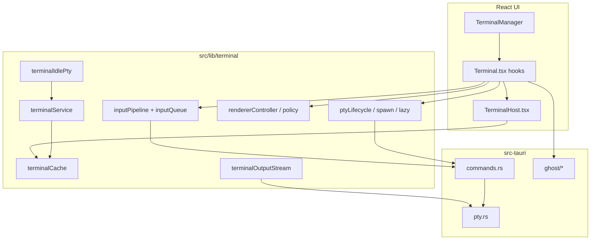

# Zync Terminal — Architecture & Reference

**Last updated:** 2026-06-29  
**Applies to:** Zync v2.19.1+

This document describes **how Zync’s integrated terminal works today** — local and remote shells, stack choices, architecture, IPC, renderer, lifecycle, ghost suggestions, settings, and code layout. It is the single place to learn what the terminal system is and how it behaves, not a development plan or backlog.

For workspace-wide tab/session restore, see [SESSION_PERSISTENCE.md](./SESSION_PERSISTENCE.md).

---

## Table of Contents

1. [Executive summary](#1-executive-summary)
2. [Technology stack](#2-technology-stack)
3. [Architecture overview](#3-architecture-overview)
4. [UI layer](#4-ui-layer)
5. [Frontend terminal library (`src/lib/terminal`)](#5-frontend-terminal-library-srclibterminal)
6. [Backend PTY (Rust)](#6-backend-pty-rust)
7. [IPC & event model](#7-ipc--event-model)
8. [Renderer: WebGL & DOM](#8-renderer-webgl--dom)
9. [Input pipeline](#9-input-pipeline)
10. [Output streaming](#10-output-streaming)
11. [PTY lifecycle & lazy spawn](#11-pty-lifecycle--lazy-spawn)
12. [Idle host PTY suspend](#12-idle-host-pty-suspend)
13. [Resize & layout](#13-resize--layout)
14. [Theme, typography & transparency](#14-theme-typography--transparency)
15. [Ghost suggestions](#15-ghost-suggestions)
16. [Session persistence (terminal)](#16-session-persistence-terminal)
17. [Settings layout](#17-settings-layout)
18. [Design decisions & policies](#18-design-decisions--policies)
19. [Testing](#19-testing)
20. [Known gaps & optional polish](#20-known-gaps--optional-polish)
21. [File map](#21-file-map)

---

## 1. Executive summary

Zync embeds a full terminal per workspace connection (plus a local shell) using **xterm.js 6.x** inside a Tauri desktop app. The stack optimizes for:

- **Tab persistence** — scrollback and xterm instances survive tab switches via a module-level cache
- **Lazy PTY spawn** — backend shells start when a shell tab is first selected
- **Generation-gated IPC** — stale output/exit events are ignored after respawn or suspend
- **Batched I/O** — input and output coalescing on frontend and Rust paths
- **GPU rendering** — WebGL2 primary with automatic DOM fallback
- **Opt-in resource reclaim** — background remote host PTYs can suspend after idle timeout

Each workspace can have multiple shell tabs. A **local shell** (`LOCAL_TERMINAL_CONNECTION_ID`) runs without SSH; **remote shells** attach to the active host connection. Only one shell terminal is mounted in the UI at a time, but inactive tabs keep their xterm instance and scrollback in `terminalCache`.

---

## 2. Technology stack

### What we use

| Layer | Choice | Notes |
|-------|--------|-------|
| Terminal UI | `@xterm/xterm` **^6.0.0** | Core emulator |
| Addons (always) | `fit`, `search`, `web-links` | Loaded per instance in lifecycle hook |
| GPU | `@xterm/addon-webgl` ^0.19.0 | Lazy-loaded; primary renderer when enabled |
| Ligatures | `@xterm/addon-ligatures` ^0.10.0 | Compatible with WebGL via reactivate-after-ligatures order |
| Fallback renderer | xterm **built-in DOM** | GPU off, WebGL init failure, or context loss |
| Desktop bridge | Tauri 2.x | `terminal:*` commands + `Channel` for PTY output |
| Local PTY | `portable-pty` (Rust) | Windows ConPTY, Unix pseudoterminals |
| Remote PTY | SSH channel in `pty.rs` | Batched read/write; resize coalescing |
| Process probe | `sysinfo` (local) | Child-tree scan for idle-suspend deferral (fail-closed) |
| State | Zustand `terminalSlice` + module `terminalCache` | Store owns tab metadata; cache owns live xterm/PTY binding |
| Ghost engine | Rust `src-tauri/src/ghost/*` + TS `src/lib/ghostSuggestions/*` | History frecency + filesystem path completion |

### What we do **not** use (removed or never adopted)

| Item | Reason |
|------|--------|
| `@xterm/addon-canvas` | **Removed** — xterm 6 dropped canvas addon; DOM is the non-WebGL path |
| `terminal-output-{sessionId}` Tauri events | **Removed** — replaced by Tauri `Channel` frames (v2.19.x) |
| Base64 JSON `number[]` as primary output transport | Legacy decode kept in `terminalOutputPayload.ts` for dev safety only |
| Private xterm APIs (`_core._renderService`) | **Removed** — ghost/cursor sizing uses `.xterm-char-measure-element` |
| `windowsMode` / `fastScrollModifier` xterm options | Removed in xterm 6; not reintroduced |
| Canvas renderer aliases (`activateCanvasRenderer` exports) | **Removed** in Phase 7; use DOM APIs |
| Auto SSH respawn after idle suspend | **Rejected** — user presses **Enter** to resume; scrollback preserved |
| Immediate PTY kill on sidebar host switch | **Rejected** — remote hosts share one idle timer when opt-in suspend is enabled |
| Scrollback reflow on window resize | **Intentionally off** (`reflowCursorLine: false`) — correct terminal semantics |
| Injected shell integration for CWD | **Passive OSC 7 only** — no prompt injection |
| Idle suspend on **local** workspace shell | **Excluded by policy** — `LOCAL_TERMINAL_CONNECTION_ID` never idle-suspended |

---

## 3. Architecture overview



**Data ownership:**

- **`terminalSlice`** — tab list per connection, titles, `pendingRestore`, synced terminal id
- **`terminalCache`** — live `XTerm`, addons, generation, spawn flags, output channel, renderer session
- **`terminalService`** — store-facing destroy/suspend/close-tab-on-exit API (decouples slice from React)

---

## 4. UI layer

| File | Role |
|------|------|
| `TerminalManager.tsx` | Mounts one active shell terminal; keeps inactive tabs warm; routes snippet/plugin writes through `queueTerminalInput` |
| `Terminal.tsx` | Hook wiring (~270 lines): lifecycle, theme, search, ghost, keybindings, global shortcuts |
| `TerminalHost.tsx` | Connected-state presentation: search bar, context menu, ghost overlays, xterm container |
| `TerminalDisconnectedView.tsx` | Connecting / error / reconnect UI for remote hosts |
| `TerminalSearchBar.tsx` | Find UI; removed from DOM when closed (a11y) |
| `TerminalContextMenu.tsx` | Copy/paste via shared clipboard helper |
| `GhostSuggestionOverlay.tsx` | Inline ghost suffix at cursor |
| `GhostSuggestionListOverlay.tsx` | Popup list (portal to `document.body`) |
| `useTerminalLifecycle.ts` | xterm init, spawn/suspend, resize scheduler, renderer sync, output channel attach |
| `useTerminalTheme.ts` | Live theme/accent/opacity sync to open terminals |
| `useTerminalSearch.ts` | Search addon state |
| `useTerminalGhost.ts` | Ghost runtime binding |
| `useTerminalKeybindings.ts` | xterm custom key handlers |
| `useTerminalGlobalShortcuts.ts` | App-level paste/find guards when xterm focused |
| `terminalTheme.ts` | xterm theme resolution, transparency host styles |

**Connection identity:**

- `LOCAL_TERMINAL_CONNECTION_ID` in `connectionIds.ts` (canonical; re-exported from `tabService.ts`)
- Remote terminals use connection id as `terminalKey` / `sessionId`

---

## 5. Frontend terminal library (`src/lib/terminal`)

Public surface exported from `index.ts`. Key modules:

| Module | Responsibility |
|--------|----------------|
| `terminalCache.ts` | Module-level `Map<sessionId, TerminalCache>` — xterm, fit/search addons, generation, flags, output channel |
| `xtermOptions.ts` | Central `buildXtermOptions()` — scrollback 5000, `reflowCursorLine: false`, `windowsPty` for local Win only |
| `ptyLifecycle.ts` | `spawnTerminalSession`, `suspendTerminalPty` |
| `spawnContext.ts` | CWD / shell resolution for spawn |
| `terminalSpawn.ts` | `spawnTerminalFromStoreContext` — store-aware spawn entry |
| `terminalLazyPty.ts` | `resolveLazyPtyAction` — defer spawn until active shell tab |
| `inputPipeline.ts` | 4ms / 64-byte input batching; ready/suspend gating; `queueTerminalInput` |
| `inputQueue.ts` | Serialized async `onData` + ghost middleware; epoch bump on suspend/destroy |
| `terminalOutputStream.ts` | Tauri `Channel` attach; u32 LE generation + raw bytes decode |
| `terminalOutputPayload.ts` | Legacy base64/array decode (dev fallback) |
| `terminalLifecycleListeners.ts` | `terminal-ready` / `terminal-exit` listeners; generation match; close tab on natural exit |
| `terminalConnectionWakeup.ts` | SSH reconnect wakeup dispatch + handler |
| `terminalResizeSync.ts` | Deduped PTY resize IPC |
| `terminalFit.ts` | `createResizeScheduler` (60ms trailing), `safeFitTerminal` |
| `terminalPanelRestore.ts` | Refit/redraw after Files/Dashboard overlay |
| `rendererPolicy.ts` | Pure WebGL vs DOM resolution |
| `rendererController.ts` | Lazy WebGL load, in-flight race guards, `syncTerminalRenderer` |
| `rendererSession.ts` | Per-session renderer state |
| `rendererLifecycle.ts` | DOM fallback activation, dispose, screen refresh |
| `rendererSetup.ts` | GPU + ligatures activation order |
| `rendererDiagnostics.ts` | Settings → Terminal renderer status panel |
| `webglCapability.ts` | Cached WebGL2 probe |
| `ligatures.ts` | LigaturesAddon load/dispose |
| `instanceApi.ts` | `destroyTerminalInstance`, `getTerminalRecentLines` |
| `terminalService.ts` | `destroy`, `suspendAllForConnection`, `closeTabOnShellExit`, `getRecentLines` |
| `terminalIdlePty.ts` | Idle-host suspend scheduler (wired from `MainLayout`) |
| `terminalIdleSuspendNotice.ts` | Synchronous suspend banner (no `terminal-exit` on kill) |
| `terminalActivity.ts` | Activity timestamps for busy deferral |
| `terminalProcessActivity.ts` | IPC wrapper for `terminal_has_active_processes` |
| `terminalSpawnErrors.ts` | User-friendly unreachable-host messages |
| `terminalClipboard.ts` | Tauri + browser fallback clipboard |
| `terminalTypography.ts` | Font weight bold pairing for GPU atlas |
| `suspendAllTerminals.ts` | Connection-scoped suspend |
| `terminalReloadTeardown.ts` | Dev HMR channel callback revoke |

---

## 6. Backend PTY (Rust)

| File | Responsibility |
|------|------|
| `src-tauri/src/pty.rs` | PtyManager: local spawn/read/write/resize/close; remote SSH reader; output batching (8ms / 4KB); explicit `child.kill()` on close |
| `src-tauri/src/commands.rs` | `terminal_create` (accepts output `Channel`), `terminal_write`, `terminal_resize`, `terminal_has_active_processes`, close variants |
| `src-tauri/src/ghost/*` | Ghost suggestion persistence, parser, ranking, Tauri commands |

**Output batching (remote & local):** `REMOTE_OUTPUT_BATCH_MS` / `OUTPUT_FLUSH_THRESHOLD` coalesce before sending to frontend channel.

**Resize (remote):** SSH resize channel drains to latest cols/rows (trailing coalesce).

---

## 7. IPC & event model

### Commands (invoke)

- `terminal:create` — spawns PTY; frontend passes `Channel` for output
- `terminal:write` — batched input from `inputPipeline`
- `terminal:resize` — cols/rows from unified resize scheduler
- `terminal:close` / `terminal:close_by_connection` — programmatic teardown (**no** `terminal-exit`)
- `terminal_has_active_processes` — local sysinfo child-tree probe

### Events (listen)

| Event | Purpose |
|-------|---------|
| `terminal-ready-{sessionId}` | `{ generation }` — flushes input buffer; clears idle guard |
| `terminal-exit-{sessionId}` | `{ generation, exit_code? }` — **natural shell exit only**; closes tab or shows idle notice |

### Generation gating

Each spawn/suspend bumps `generation` on the cache entry. Output channel frames carry generation in the first 4 bytes (u32 LE). Stale frames and exit events are dropped after restart.

### Exit semantics (v2.19.x)

| Path | `terminal-exit` emitted? | Frontend behavior |
|------|--------------------------|-----------------|
| User types `exit` / shell ends | Yes | Close shell tab via `terminalService.closeTabOnShellExit` |
| Idle suspend kill | No | Write suspend notice; `suspendedByIdle` flag |
| Panel overlay suspend | No | `suspendedByPanel`; respawn on return |
| Programmatic close | No | Tear down handles only |

---

## 8. Renderer: WebGL & DOM

### Policy (`rendererPolicy.ts`)

```
gpuAcceleration off          → DOM
webglContextLossBlocked      → DOM
otherwise                    → WebGL (if WebGL2 probe passes)
```

**Ligatures:** Not mutually exclusive with WebGL. Activation order: **WebGL → LigaturesAddon → WebGL reactivate** so `font-feature-settings` reach the glyph atlas.

### Fallback chain

`WebGL → DOM → log warning` — terminal never blanks on renderer failure.

### Inactive tab behavior

Switching shell tabs re-applies WebGL on the active tab (`syncTerminalRenderer`). Background tabs may stay on DOM until reselected.

### Settings

- `settings.terminal.gpuAcceleration` (default `true`) — **Settings → Terminal**
- Live renderer status panel on same tab (`TerminalRendererStatus.tsx`)

### Tests

`npm run test:terminal-renderer` — policy, probe cache, session ownership, controller sync, diagnostics, setup helper.

---

## 9. Input pipeline

```
xterm.onData
  → inputQueue (serialized tasks, ghost middleware)
    → inputPipeline.queueTerminalInput
      → batch 4ms / 64 bytes (immediate flush for \r \n \x03 \x04 \x1b)
        → terminal:write IPC (only if spawned && !starting)
```

**Ready gating:** Input buffers while `starting` or `!spawned` until `terminal-ready` with matching generation.

**External writes:** Snippets, plugins, command palette route through `queueTerminalInput` (not raw `terminal:write`).

**Ghost IPC:** Skipped when shell tab is hidden (`isVisibleRef`).

---

## 10. Output streaming

**Current (v2.19.x):** Tauri `Channel` registered before `terminal:create`. Each message:

```
[ u32 generation (LE) ][ raw PTY bytes... ]
```

Decoded in `terminalOutputStream.ts` → `term.write()` after generation check.

**Legacy:** `terminal-output-*` events removed. `terminalOutputPayload.ts` retains base64/array decode for older dev builds.

---

## 11. PTY lifecycle & lazy spawn

### `resolveLazyPtyAction` policy

| Visibility | Action |
|------------|--------|
| Workspace inactive | `none` |
| Not terminal view (Files/Dashboard overlay) | `none` — PTY stays alive; panel hidden via CSS |
| Not active shell tab | `none` — defer spawn |
| Active shell tab, not spawned | `spawn` |
| Active shell tab, spawned | `none` |

**Intentional:** Switching sidebar hosts or internal shell tabs **keeps PTYs alive** (scrollback + running processes). Opt-in idle suspend (§12) is the separate background reclaim path.

### Spawn flow (simplified)

1. `spawnTerminalFromStoreContext` resolves CWD/shell
2. `attachTerminalOutputChannel` registers Channel
3. `terminal:create` IPC
4. `attachTerminalLifecycleListeners` once per cache entry
5. `terminal-ready` → flush input, apply renderer, fit

### Suspend flow

- **Panel leave** (`suspendTerminalPty`): sets `suspendedByPanel`; kills PTY; preserves cache scrollback
- **Idle suspend** (§12): sets `suspendedByIdle`; synchronous notice; no tab close

---

## 12. Idle host PTY suspend

**Opt-in:** Settings → Terminal → **Suspend idle host shells** (default **off**).

| Rule | Behavior |
|------|----------|
| Scope | **Remote workspace hosts only** — local shell excluded |
| Timer | Configurable minutes (1–60, default 2); shared across remote host shell tabs on that connection |
| Busy deferral | Recent output/input since backgrounding resets quiet window |
| Process deferral | `terminal_has_active_processes` (local sysinfo, fail-closed) retries with minimum delay |
| On fire | `suspendAllTerminalsForConnection` — kill PTY, keep `terminalCache` scrollback |
| Resume | User presses **Enter** in suspended shell → lazy respawn on active tab (no auto SSH reconnect loop) |

Wired from `MainLayout.tsx` when setting enabled. Tests: `terminalIdlePty.test.mjs`, `terminalIdleHostSuspend.test.mjs`.

---

## 13. Resize & layout

### Expected behavior (not a bug)

Historical scrollback **does not reflow** when the window is resized. Lines written at a narrow width stay wrapped; **new** input uses the new column count. xterm on Windows ConPTY disables scrollback reflow by design (`reflowCursorLine: false`, `windowsPty` for local only).

### Mechanisms (all funnel through scheduler)

- `ResizeObserver` on terminal container — **gated on `isVisibleRef`**
- Window resize
- Layout transitions (sidebar, panel) — visual `fit()` immediately; PTY IPC deferred until settle (500ms safety timeout)
- Renderer kind changes — refit + screen refresh
- Files/Dashboard return — `terminalPanelRestore` + `isTerminalDomMeasurable`

**Scheduler:** `createResizeScheduler` — 60ms trailing edge in `terminalFit.ts`.

### Regression watchlist (mitigated — re-check after layout/GPU changes)

| Symptom | Mitigation |
|---------|------------|
| Black margins around xterm | `.terminal-container` fill CSS, `safeFitTerminal` |
| Garbled text after resize | Trailing scheduler + post-fit refresh |
| PTY cols/rows drift | Hidden-tab gate; defer IPC until layout settle |
| Double framebuffer | Single active renderer path (WebGL **or** DOM) |

---

## 14. Theme, typography & transparency

### Live sync

Theme, accent, and opacity changes apply to **open** terminals immediately (`useTerminalTheme` + cache refresh), including the local shell with no active workspace connection.

### Light themes

Terminal ANSI palette follows theme plugin manifest `mode` (with luminance fallback). Light themes use high-contrast ANSI defaults.

### Typography

- Font weight setting pairs regular + bold weights for GPU atlas rebuild (`terminalTypography.ts`)
- Settings → **Appearance → Terminal** (font family, weight, size, padding, line height, ligatures)
- Windows recommended reset: Consolas-first, 15px, medium (500)

### Transparency

- `allowTransparency: true` on xterm; host-level `color-mix` background via `buildTerminalHostStyle`
- xterm 6 default `#000` viewport overridden in `index.css` for vibrancy
- Opacity + desktop transparency under Appearance → Terminal

---

## 15. Ghost suggestions

Zync provides fish-style inline ghost text, Tab popup lists, per-scope command history (Rust frecency), and filesystem path completion. Ghost input runs through `inputQueue` so it cannot reorder shell keystrokes.

**Full documentation:** [TERMINAL_GHOST_SUGGESTIONS.md](./TERMINAL_GHOST_SUGGESTIONS.md) — file map, event flow, key bindings, settings, and change notes.

**At a glance:**

- UI: `useTerminalGhost.ts`, `GhostSuggestionOverlay.tsx`, `GhostSuggestionListOverlay.tsx`
- Logic: `src/lib/ghostSuggestions/*`
- Backend: `src-tauri/src/ghost/*`
- Settings: **Settings → Terminal → Ghost suggestions**
- IPC skipped when shell tab is hidden

---

## 16. Session persistence (terminal)

Terminal tabs are restored from `session.json` per connection scope. See [SESSION_PERSISTENCE.md](./SESSION_PERSISTENCE.md) for full workspace restore flow.

**Terminal-specific rules:**

- SSH tabs restore with `pendingRestore: true` — reconnect before PTY spawn; `TerminalDisconnectedView` UI
- CWD captured **passively** via OSC 7 in `Terminal.tsx` (starship, oh-my-posh, fish, etc.)
- `setTerminalCwd` debounced 1s into session save
- `clearPendingRestore()` after successful SSH reconnect

---

## 17. Settings layout

Post–v2.19 settings reorganization:

| Location | Controls |
|----------|----------|
| **Settings → Appearance → App** | Theme, accent, global UI font/size, compact mode |
| **Settings → Appearance → Terminal** | Monospace font, weight, size, padding, line height, ligatures, opacity, transparency, cursor style |
| **Settings → Terminal** | GPU acceleration, renderer status, idle host suspend, Windows default shell, ghost suggestions |

Terminal tab intro links jump to Appearance for look-and-feel.

---

## 18. Design decisions & policies

| Decision | Rationale |
|----------|-----------|
| Module-level `terminalCache` vs per-component xterm | Preserve scrollback across tab remounts without duplicating PTY |
| Lazy spawn on active tab only | Avoid N live PTYs for N background shell tabs |
| Keep PTYs on host/shell tab switch | User expectation: running processes and scrollback survive |
| Channel output vs per-chunk events | Lower IPC overhead; binary framing with generation |
| `terminal-exit` only on natural exit | Distinguish user `exit` from programmatic kill/suspend |
| Enter-to-resume after idle suspend | Avoid surprise SSH respawn storms |
| Local excluded from idle suspend | Local shell is the default workspace; killing it is disruptive |
| `reflowCursorLine: false` | Correct scrollback semantics on resize (§13) |
| WebGL + ligatures together | xterm-recommended order; better than mutual exclusion |
| `terminalService` facade | Decouple `terminalSlice` from React component exports |
| Passive OSC 7 only | No shell injection; works when prompt emits OSC 7 |
| Fail-closed process probe | If sysinfo fails, defer suspend rather than kill busy shell |

---

## 19. Testing

| Command | Coverage |
|---------|----------|
| `npm run test:terminal-renderer` | Renderer policy, WebGL probe, controller, diagnostics, setup |
| `npm run test:all-agent` (terminal subset) | Lifecycle, idle suspend, output stream, spawn errors, tab close, xterm options, PTY lifecycle, reconnect |
| `tests/ghostSuggestionsHelpers.test.mjs` | Ghost controller/runtime/path/tab behavior |
| `tests/sessionPersistence.test.mjs` | Session snapshot / terminal tab caps |

**Manual QA matrix (signed off v2.18–2.19):** WebGL default, GPU off → DOM, ligatures, transparency, resize/maximize, context loss, Files ↔ Terminal, Shell tab switch GPU restore, large output `cat`, idle suspend opt-in, theme live sync.

---

## 20. Known gaps & optional polish

Minor items that do not change core shell behavior today:

- Ghost suggestion fish-like parity edge cases — see [TERMINAL_GHOST_SUGGESTIONS.md](./TERMINAL_GHOST_SUGGESTIONS.md)
- Rare Windows ConPTY edge cases (`windowsPty` / `reflowCursorLine` defaults in `xtermOptions.ts`)

---

## 21. File map

### Frontend

```
src/components/terminal/
  Terminal.tsx, TerminalHost.tsx, TerminalManager.tsx
  TerminalDisconnectedView.tsx, TerminalSearchBar.tsx, TerminalContextMenu.tsx
  GhostSuggestionOverlay.tsx, GhostSuggestionListOverlay.tsx
  useTerminalLifecycle.ts, useTerminalTheme.ts, useTerminalSearch.ts
  useTerminalGhost.ts, useTerminalKeybindings.ts, useTerminalGlobalShortcuts.ts
  terminalTheme.ts

src/lib/terminal/          # See §5 — 38 modules, index.ts public API
src/lib/ghostSuggestions/  # See §15

src/store/terminalSlice.ts
src/components/settings/tabs/TerminalTab.tsx
src/components/settings/tabs/appearance/AppearanceTerminal*.tsx
src/index.css              # .terminal-container, xterm 6 viewport overrides
```

### Backend

```
src-tauri/src/pty.rs
src-tauri/src/commands.rs
src-tauri/src/ghost/
```

### Tests

```
tests/terminal*.test.mjs
tests/ghostSuggestionsHelpers.test.mjs
tests/runTerminalRendererTests.mjs
```

---

## Related documents

- [TERMINAL_GHOST_SUGGESTIONS.md](./TERMINAL_GHOST_SUGGESTIONS.md) — ghost completion system (inline, popup, history, paths)
- [SESSION_PERSISTENCE.md](./SESSION_PERSISTENCE.md) — workspace tab/session restore (includes terminal snapshots)
- [SETTINGS_SYSTEM.md](./SETTINGS_SYSTEM.md) — global settings persistence and `settings.terminal` schema

When changing terminal behavior, update this document (and the ghost doc if suggestions change) in the same change.