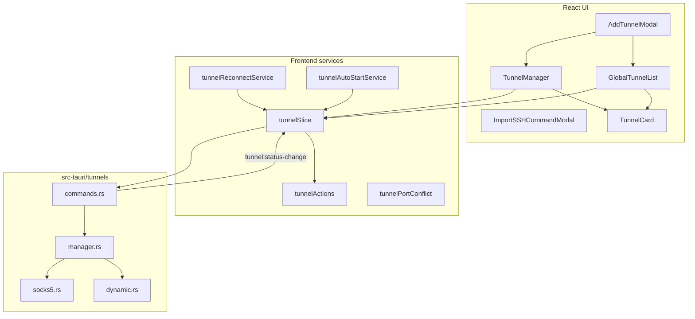

# Port Forwarding & Tunnels — Architecture & Reference

**Last updated:** 2026-07-09  
**Applies to:** Zync v2.21.0+  
**User-facing guide:** [zync.thesudoer.in/docs/port-forwarding](https://zync.thesudoer.in/docs/port-forwarding)

This document describes **how Zync’s SSH tunnel system works today** — port forwards, SOCKS proxies, architecture, lifecycle, UI surfaces, sync, and design policies. It is the single place to learn what the tunnel system is and how it behaves.

For tunnel sync and bundled host restore, see [VAULT.md](./VAULT.md).

---

## Table of Contents

1. [Executive summary](#1-executive-summary)
2. [Technology stack](#2-technology-stack)
3. [Architecture overview](#3-architecture-overview)
4. [Tunnel types](#4-tunnel-types)
5. [Lifecycle & reconnect](#5-lifecycle--reconnect)
6. [UI surfaces](#6-ui-surfaces)
7. [Auto-start](#7-auto-start)
8. [Sync & restore](#8-sync--restore)
9. [IPC & event model](#9-ipc--event-model)
10. [Persistence](#10-persistence)
11. [Design decisions & policies](#11-design-decisions--policies)
12. [Testing](#12-testing)
13. [Known limits](#13-known-limits)
14. [Future plans](#14-future-plans)
15. [File map](#15-file-map)

---

## 1. Executive summary

Zync manages **SSH port forwards** visually — the same jobs as `ssh -L`, `ssh -R`, and `ssh -D`, without hand-editing commands for every session.

| Capability | Status |
|------------|--------|
| Local forward (`-L`) — listen locally, forward via SSH | Shipped |
| Remote forward (`-R`) — listen on remote, forward to local target | Shipped |
| Dynamic / SOCKS forward (`-D`) | Shipped |
| Per-connection **Port Forwarding** tab | Shipped |
| Global tunnel dashboard (sidebar) | Shipped |
| CRUD, groups, presets, bulk create | Shipped |
| SSH command import (`ssh -L` / `-R` / `-D` paste) | Shipped |
| Port conflict detection + suggested alternate port | Shipped (local bind) |
| Opt-in **auto-start on connect** | Shipped |
| Reconnect restores active + auto-start tunnels | Shipped |
| Open in browser / copy address | Shipped |
| Sync domain + bundled restore (with host) | Shipped |
| `~/.ssh/config` `LocalForward` / `RemoteForward` import | Not implemented |

Tunnels require an **active SSH session** on the host connection. They stop when the session drops.

### Goals

- Replace ad-hoc `ssh -L/-R/-D` for common dev workflows (DB, HTTP dev server, internal APIs)
- Persist tunnel configs per connection; survive app restarts
- Global visibility across all connections
- Safe port-conflict UX on local binds
- Sync tunnels with hosts (scoped by connection / logical host id)
- Fail with clear errors (connection closed, port in use, remote refused)

### Non-goals (current scope)

- Jump-host topology editor (tunnels use the existing connected session)
- Per-tunnel bandwidth metrics dashboard
- Arbitrary `ssh -J` multi-hop tunnel chains beyond the active session

---

## 2. Technology stack

### What we use

| Layer | Choice | Notes |
|-------|--------|-------|
| SSH session | **russh** | Shared with terminal PTY; tunnels ride the active session |
| Runtime engine | `TunnelManager` | Local listeners, remote `tcpip_forward`, SOCKS relay |
| Desktop bridge | Tauri 2.x | `tunnel:*` commands + `tunnel:status-change` events |
| State | Zustand `tunnelSlice` | Single source of truth for both UI surfaces |
| Reconnect | `tunnelReconnectService` + `tunnelAutoStartService` | Restores active + `autoStart` tunnels after connect |
| Persistence | `{data_dir}/tunnels.json` | Per-tunnel config; live status is runtime-only |
| Sync | Vault `tunnels` domain | Upload/restore with host bundles |

### What we do **not** use (removed or never adopted)

| Item | Reason |
|------|--------|
| Separate SSH process per tunnel | Tunnels share the in-app russh session |
| 30s status polling in tunnel UIs | **Removed** — event-driven via `tunnel:status-change` |
| Hardcoded `127.0.0.1` start paths | **Removed** — all UI uses `tunnel:start` honoring saved `bindAddress` |
| SOCKS UDP ASSOCIATE / BIND | Not supported in v1 |
| `~/.ssh/config` forward import | Not implemented |

---

## 3. Architecture overview



**Data ownership:**

- **`tunnelSlice`** — tunnel list per connection, global list, live status, start/stop orchestration
- **`TunnelManager`** — runtime listeners and remote forward handlers; torn down on SSH disconnect
- **`tunnels.json`** — saved configs only; status (`active` / `stopped` / `error`) is computed at runtime and pushed via events

**Session binding:** Every tunnel operation requires a connected SSH session on its host. Disconnect or transport loss stops runtime forwards and emits status events; reconnect may restart tunnels per the reconnect policy (§5).

---

## 4. Tunnel types

### Local forward (`type: "local"`)

Equivalent to `ssh -L [bind:]localPort:remoteHost:remotePort`.

- Listens on `bindAddress:localPort` (default `127.0.0.1`).
- Each accepted TCP connection opens a direct-tcpip channel to `remoteHost:remotePort` over the SSH session.

### Remote forward (`type: "remote"`)

Equivalent to `ssh -R [bind:]remotePort:localHost:localPort`.

- Requests `tcpip_forward` on the SSH server for `bindAddress:remotePort`.
- Incoming forwarded connections are proxied to the local target (`remoteHost` in the saved config stores the **local target host** for `-R`).

**Server requirement:** Remote binds on non-loopback addresses need `GatewayPorts` / `AllowTcpForwarding` on `sshd` (documented on the marketing site).

### Dynamic forward / SOCKS (`type: "dynamic"`)

Equivalent to `ssh -D [bind:]localPort`.

- Listens on `bindAddress:localPort` (default `127.0.0.1`).
- Each accepted connection runs a **SOCKS5** handshake (RFC 1928 subset: no-auth, CONNECT only).
- Per-client target is opened via direct-tcpip through the SSH session.
- Persisted sentinel fields: `remoteHost: "*"`, `remotePort: 0` (no fixed remote target).

**Scope (v1):** IPv4, domain, and IPv6 targets. UDP ASSOCIATE and BIND are not supported.

**Security:** Binding to `0.0.0.0` exposes the SOCKS port on the LAN — use loopback unless intentional.

---

## 5. Lifecycle & reconnect

| Event | Behavior |
|-------|----------|
| **Create / edit** | Saved to `tunnels.json` via `tunnel:save` |
| **Start** | Requires connected session; emits `tunnel:status-change` → `active` or `error` |
| **Stop** | Tears down listener or cancels remote `tcpip_forward` |
| **SSH disconnect** | Runtime tunnels stopped; status → `stopped` |
| **Transport drop** | Fatal SSH errors stop active listeners; `connection:transport-lost` suspends PTY (tabs kept); active tunnels stopped |
| **Reconnect** | Restarts tunnels that were **active before disconnect** plus any with `autoStart: true` |
| **Delete** | Config removed (stop first if active) |

### Port conflict (local bind)

When a local port is already in use, the backend returns a message with process hint and a **suggested next free port**. The UI may offer one-click switch; `originalPort` tracks revert on stop.

### Reconnect policy

On successful host connect:

1. Load tunnels for the connection
2. Restart tunnels that were active before disconnect **or** have `autoStart`
3. On any success, pin `port-forwarding` feature on the connection (silent; no view switch)

Failed restarts on reconnect surface a **toast** per tunnel.

---

## 6. UI surfaces

| Surface | Role |
|---------|------|
| **Port Forwarding tab** | Per-host tunnel list; grid/list toggle; start/stop/edit |
| **Global dashboard** | All tunnels across connections; search; grid/list; group collapse |
| **Add / edit modal** | Presets, bind address, auto-start, groups |
| **Import modal** | Paste `ssh -L` / `-R` / `-D` command |
| **Tunnel card** | Status, flow line, type badges (incl. SOCKS), action bar |

**Global list grouping:** UI groups by user-defined `group` field, **not** by connection. Connection name appears on each card.

**Parity:** Both surfaces share `tunnelSlice` state. Start/stop from either surface reflects immediately in the other via events.

**Open in browser:** Shown only when tunnel is **active** and type supports a direct URL (local HTTP-style forwards).

All start/stop paths go through `tunnelSlice` → `tunnel:start`, honoring saved `bindAddress`.

---

## 7. Auto-start

**Setting:** per-tunnel `autoStart` in the Add Tunnel modal (“Auto-start tunnel when connection opens”).

**Behavior:** When the host connects, tunnels with `autoStart` enabled start automatically alongside any tunnels that were active before the last disconnect (§5).

**Failures:** Toast per failed tunnel restart on reconnect.

---

## 8. Sync & restore

Tunnels are a **sync domain** (`tunnels`) in Vault / Sync & Backup.

| Operation | Purpose |
|-----------|---------|
| Upload | Push local `tunnels.json` entries to provider |
| Restore | Merge remote tunnel records |
| Bundled host restore | After hosts restore, tunnels whose `connectionId` matches restored host logical ids are restored |

Orphan tunnels (host not in restore set) are skipped with counts. See [VAULT.md](./VAULT.md) for sync architecture and bundle restore behavior.

---

## 9. IPC & event model

### Commands (frontend → backend)

| Command | Purpose |
|---------|---------|
| `tunnel:save` | Persist tunnel config |
| `tunnel:delete` | Remove config |
| `tunnel:list` | List for one `connectionId` with live `status` |
| `tunnel:getAll` | All tunnels with live `status` |
| `tunnel:start` | Load config by id, honor `bindAddress` |
| `tunnel:stop` | Stop by saved tunnel id |
| `ssh_parse_command` | Parse pasted `ssh` command for `-L`/`-R`/`-D` |

### Events (backend → frontend)

| Event | Payload |
|-------|---------|
| `tunnel:status-change` | `{ id, status: active \| stopped \| error, error? }` |

Status updates are **event-driven**. Tunnel UIs subscribe to `tunnel:status-change`; there is no polling timer.

---

## 10. Persistence

**File:** `{data_dir}/tunnels.json`

Each saved tunnel includes:

| Field | Meaning |
|-------|---------|
| `id` | Stable UUID |
| `connectionId` | Host this tunnel belongs to |
| `name` | Display name |
| `type` | `local` \| `remote` \| `dynamic` |
| `localPort` | Local listen port (all types) |
| `remoteHost` / `remotePort` | Remote target (local/remote types); `*` / `0` for dynamic |
| `bindAddress` | **Source of truth** for listen/bind address when starting |
| `autoStart` | Start on host connect |
| `group` | Optional global-list grouping |
| `originalPort` | Tracks port before conflict-resolution swap |

Live `status` is not persisted — it is derived at runtime and pushed via events.

---

## 11. Design decisions & policies

| Decision | Rationale |
|----------|-----------|
| Session-bound tunnels | A tunnel is only as stable as its SSH connection |
| One start path (`tunnel:start`) | Every UI entry point must honor saved `bindAddress` |
| Explicit lifecycle | Start/stop are user-visible; auto-start is opt-in per tunnel |
| Reconnect restores last active | Users expect forwards to come back after brief disconnects |
| Event-driven UI | Avoid stale cards and polling latency |
| Host-scoped sync | Tunnel restore follows restored hosts; orphans skipped |
| Runtime IDs scoped by connection | Two hosts can use the same port numbers without cross-wiring |
| Local port conflict UX | Suggest alternate port + revert on stop rather than hard fail |
| SOCKS v1 subset | CONNECT-only, no-auth — matches common `ssh -D` usage |
| Transport drop ≠ tab close | PTY suspends; tunnels stop; user can reconnect without losing workspace |

---

## 12. Testing

| Command | Coverage |
|---------|----------|
| `cd src-tauri && cargo test tunnel` | Runtime IDs, sync domain, SOCKS bind parsing |
| `npm run test:tunnel-autostart-service` | Auto-start on connect |
| `npm run test:tunnel-reconnect-service` | Active + autoStart restore after reconnect |
| `npm run type-check` | Frontend compile safety |

**Manual QA matrix:** local/remote/SOCKS forwards, bind address honor, reconnect restore, auto-start, disconnect hygiene, global list parity, port conflict revert, cross-connection port scoping, bundled sync restore.

---

## 13. Known limits

| Limit | Detail |
|-------|--------|
| **Remote port uniqueness** | One remote forward per `remote_port` per SSH session (by design) |
| **SSH config import** | `LocalForward` / `RemoteForward` from `~/.ssh/config` not implemented |
| **SOCKS advanced modes** | No UDP ASSOCIATE, BIND, or username/password auth |
| **Marketing doc drift** | Landing page `/docs/port-forwarding` may lag shipped behavior |

---

## 14. Future plans

Directional work — not a commitment order.

### SOCKS enhancements

- Username/password auth (RFC 1929)
- UDP ASSOCIATE for DNS-over-SOCKS clients
- Per-connection connection limits / rate limiting

### SSH config forward import

- Parse `LocalForward` / `RemoteForward` from imported `~/.ssh/config` blocks
- Map `Host` → Zync connection id when names match

### Reconnect semantics

| Mode | Today / proposed |
|------|------------------|
| Manual only | User stopped tunnel before disconnect — stays stopped |
| Auto-start | `autoStart` tunnels start on connect |
| Restore last session | Active tunnels before disconnect restart on reconnect |
| Always-on profile (proposed) | Per-connection profile to start a fixed set whenever connected |

### Observability

- Bytes in/out per tunnel (optional)
- Last error + uptime on tunnel cards
- Health probe for HTTP forwards (optional HEAD request)

### UI

- Optional “group by connection” toggle on global list
- Jump-host hint when session uses `ProxyJump` (informational)

### Backend

- Continue extracting non-tunnel concerns from the monolithic `commands.rs` (SSH, terminal, FS) using the same module pattern as `src-tauri/src/tunnels/`

---

## 15. File map

### Frontend

```
src/components/tunnel/
  TunnelManager.tsx, GlobalTunnelList.tsx, TunnelCard.tsx

src/components/modals/
  AddTunnelModal.tsx, ImportSSHCommandModal.tsx

src/features/tunnels/
  domain/tunnelTypes.ts
  application/tunnelActions.ts, tunnelReconnectService.ts, tunnelPortConflict.ts

src/features/connections/application/
  tunnelAutoStartService.ts

src/store/tunnelSlice.ts
src/lib/tunnelPresets.ts
```

### Backend

```
src-tauri/src/tunnels/
  mod.rs, manager.rs, commands.rs, socks5.rs, dynamic.rs

src-tauri/src/sync/domain_tunnels.rs
```

### Tests

```
tests/tunnelAutoStartService.test.mjs
tests/tunnelReconnectService.test.mjs
```

---

## Related documents

- [VAULT.md](./VAULT.md) — sync domains including tunnels
- [SESSION_PERSISTENCE.md](./SESSION_PERSISTENCE.md) — `port-forwarding` tab restore
- [SECURITY.md](./SECURITY.md) — restore preview warnings

When changing tunnel behavior, update this document in the same change.