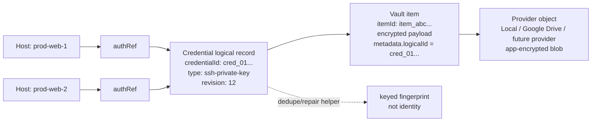
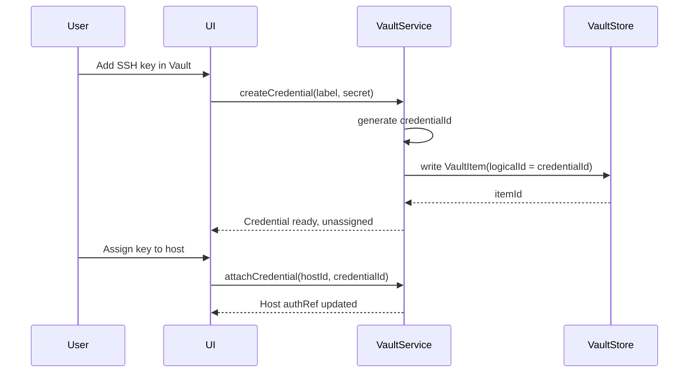
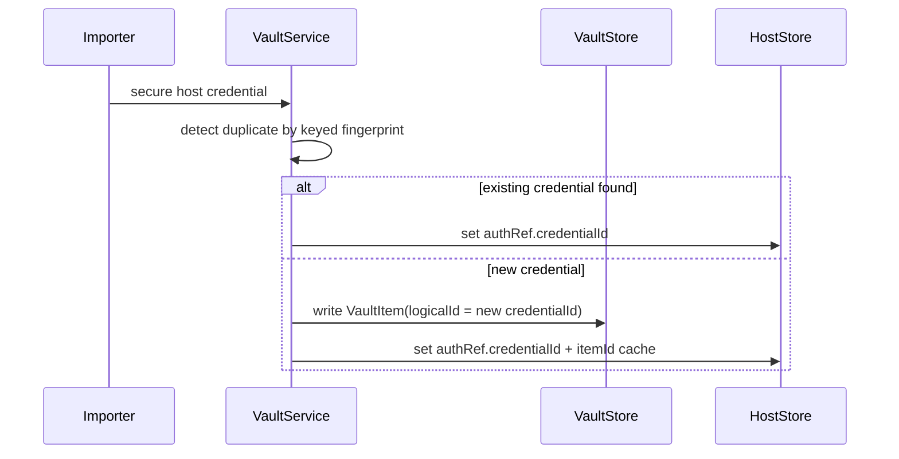
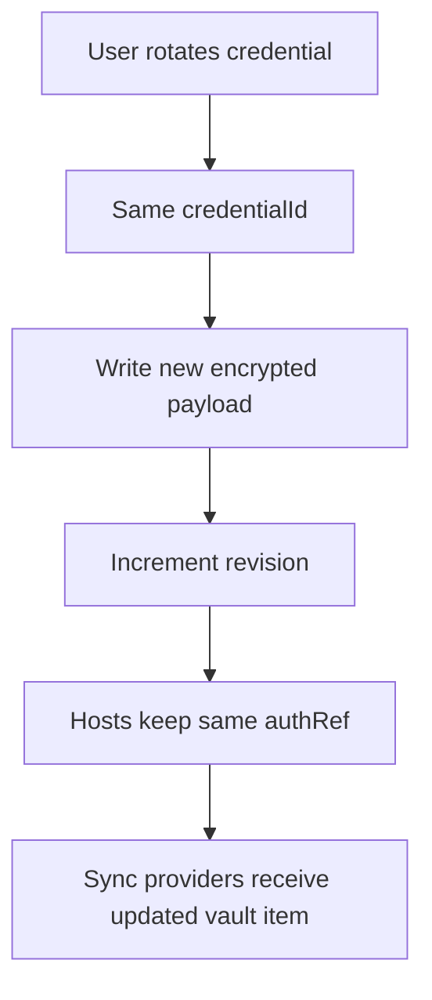
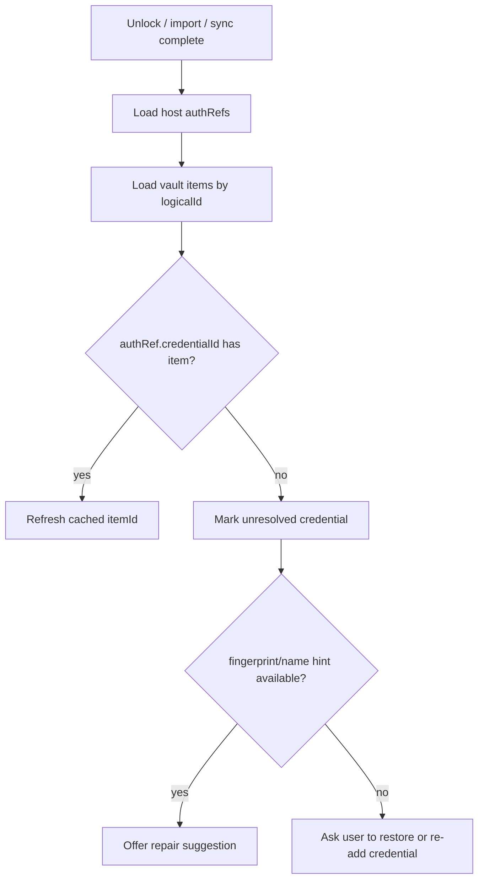

# Zync Vault & Sync — Current Documentation

**Last updated:** 2026-06-15  
**Roadmap / future work:** [VAULT_ROADMAP.md](./VAULT_ROADMAP.md)

Canonical vault + sync reference for implemented behavior, architecture, and operations.

## Table of Contents

1. [Architecture & Product IA](#1-architecture--product-ia)
2. [Credential Identity Model](#2-credential-identity-model)
3. [Credential Types Model](#3-credential-types-model)
4. [Provider Sync Key Model](#4-provider-sync-key-model)
5. [Phase 2 Closure Status](#5-phase-2-closure-status)
6. [Phase 2 Smoke Test](#6-phase-2-smoke-test)
7. [Implemented Sync Features (Phase 3+)](#7-implemented-sync-features-phase-3)

---

## 1. Architecture & Product IA

## Status
- **Owner:** Core app team
- **Document type:** Architecture + implementation guide
- **Last updated:** 2026-06-14
- **Scope:** Vault UX, vault core, provider abstraction, sync engine, and future app-data sync

---

## 1) Problem Statement
Vault currently exists primarily as a settings tab workflow. This reduces discoverability, limits operational clarity for sync, and makes future provider expansion hard to manage.

We need a modular, robust, scalable, and maintainable architecture that:
1. Makes vault a first-class product feature.
2. Preserves local-first, secure secret management.
3. Supports multiple sync providers without coupling vault core to provider implementations.
4. Scales from secrets sync to broader app-data domain sync over time.

---

## 2) Goals / Non-Goals

### Goals
- First-class **Vaults** navigation in primary sidebar.
- Strong **local vault core** with clear security boundaries.
- Pluggable provider interface for cloud backends.
- Per-provider sync profiles (manual + optional autosync).
- Predictable conflict handling and operator-visible sync state.
- Forward-compatible design for syncing additional domains (hosts, snippets, tunnels, settings, etc.).
- Connection-scoped restore orchestration (implemented — see [§7](#7-implemented-sync-features-phase-3); plan in [VAULT_ROADMAP.md §3](./VAULT_ROADMAP.md#3-connection-bundle-restore-reference)).

### Non-Goals (phase 1)
- Cross-provider automatic merge of the same logical item.
- Fully decentralized multi-writer conflict-free collaboration.
- Team vault server protocol implementation (deferred).

---

## 3) Guiding Principles
1. **Security-first core:** cryptography and key material remain in trusted backend modules.
2. **Local-first UX:** users can always work offline with local vault.
3. **Least coupling:** vault core must not call provider SDKs directly.
4. **Stable contracts:** provider interface versioning and capability negotiation.
5. **Small composable modules:** sync orchestration separate from crypto/store/UI.
6. **Observability by default:** status, timestamps, errors, and conflict states are surfaced.
7. **Incremental rollout:** no big-bang rewrite; preserve backward compatibility.

---

## 4) High-Level Architecture

```text
UI (Sidebar Vaults + Vault tabs + Sync status)
  -> Vault Application Service (commands / policy / orchestration)
      -> Vault Core (crypto + store + lock state)
      -> Sync Engine (state machine + conflict resolver + retries)
          -> Provider Registry (capability-aware adapters)
              -> Providers (Google Drive, GitHub, AWS, Custom Plugin)
```

### Mandatory Boundary
- Vault Core never imports provider-specific code.
- Provider adapters never access plaintext keys directly unless explicitly required by domain contract.
- Provider sync encryption policy is defined separately in
  [§4 Provider Sync Key Model](#4-provider-sync-key-model).

---

## 5) Product Information Architecture (IA)

### Sidebar
- Add top-level section: **Vaults**
  - Local Vault
  - Remote Profiles (Google, GitHub, AWS, Custom)
  - Team Vault (future)
  - `+ Add Provider`

### Tab Behavior
- Clicking a vault/profile opens a standard app tab.
- Each tab includes:
  - vault state (locked/unlocked)
  - item list/search
  - provider status
  - sync controls (upload, download, autosync toggle)
  - conflict badge if pending conflicts

### Discoverability rules
- If vault uninitialized, show global CTA: “Set up Vault”.
- In credential creation flows, default recommendation: “Store in Vault”.

### Local vault lock lifecycle

```text
App start
  -> vault_status (try OS keychain session restore)
      -> unlocked: work normally
      -> locked: wait for explicit unlock or remembered-device restore on next refresh
Explicit unlock/create
  -> optional remember_on_device writes session cache to OS keychain
Lock (user action)
  -> clear in-memory vek only
Forget this device
  -> delete OS keychain session cache for current vault_id
```

Host connect policy:

- **Vault-backed hosts:** opening a tab does not auto-connect; user must reconnect explicitly.
- **Plaintext/key-file hosts:** existing auto-connect-on-open-tab behavior remains.
- **Explicit connect/test/save:** may open the global unlock modal when vault is locked.

See [§2 Credential Identity Model](#2-credential-identity-model) §1.2 for the full session-unlock model.

---

## 6) Domain Model

For the detailed durable credential identity model that supports key-first vault UX,
host assignment, rotation, and stale-reference repair, see
[§2 Credential Identity Model](#2-credential-identity-model).
For canonical credential kinds, named secret fields, and schema migration rules,
see [§3 Credential Types Model](#3-credential-types-model).

### Core entities
- `Vault`
  - id, type (`local`, `team`), state (`uninitialized|locked|unlocked`)
- `VaultItem`
  - id, kind, label, encrypted payload, metadata, revision, timestamps
- `SyncProfile`
  - id, vault_id, provider_kind, enabled, autosync_policy, last_sync, health
- `SyncCursor`
  - profile_id, domain, remote_version, remote_etag, sync_token, last_applied_clock
- `Conflict`
  - id, profile_id, domain, item_id, local_meta, remote_meta, status

### Future domain sync abstraction
- `SyncDomain` enum:
  - `secrets`
  - `hosts`
  - `snippets`
  - `tunnels`
  - `settings`
  - `known_hosts`

---

## 7) Provider Contract (Plugin-Compatible)

Define a versioned backend interface (Rust trait + IPC shape):

```rust
trait VaultProviderV1 {
    fn kind(&self) -> ProviderKind;
    fn capabilities(&self) -> ProviderCapabilities;

    // connection/auth
    async fn connect(&self, ctx: ProviderContext) -> Result<ProviderIdentity>;
    async fn disconnect(&self, ctx: ProviderContext) -> Result<()>;
    async fn health_check(&self, ctx: ProviderContext) -> Result<ProviderHealth>;

    // object ops
    async fn list(&self, req: ListRequest) -> Result<Vec<ObjectMeta>>;
    async fn read(&self, req: ReadRequest) -> Result<ObjectPayload>;
    async fn write(&self, req: WriteRequest) -> Result<WriteResult>;
    async fn delete(&self, req: DeleteRequest) -> Result<()>;

    // incremental sync support
    async fn get_cursor(&self, req: CursorRequest) -> Result<ProviderCursor>;
}
```

```rust
struct WriteRequest {
    path: String,
    payload: Vec<u8>,
    idempotency_key: Option<String>,
    if_match: Option<String>,
}

struct DeleteRequest {
    path: String,
    idempotency_key: Option<String>,
    expected_revision: Option<String>,
}
```

Provider contract notes:
- `list` and `read` must be safe to retry.
- `write` and `delete` may be retried; callers should provide `idempotency_key`.
- Providers must honor `if_match` / `expected_revision` preconditions when supplied.
- Providers must normalize failed preconditions to `conflict_precondition_failed` so conflict handling is provider-agnostic.

### Capability flags
- `supports_autosync`
- `supports_incremental`
- `supports_etag`
- `supports_domains`
- `max_object_size`
- `encryption_mode` (`provider_encrypted`, `app_encrypted_only`)

---

## 8) Sync Strategy

### 8.1 Local-first semantics
- Local store is immediately updated.
- Sync engine asynchronously reconciles with each enabled profile.
- Future normal sync is per-credential provider records, not full `vault.redb` replacement.
- Provider-backed domains may be browsed as remote inventory before local materialization.
  Current example: Google host records can be listed without restoring them into local host storage.

### 8.2 Per-profile state machine
- `idle -> syncing -> success|conflict|retrying|error`

### 8.3 Conflict policy (phase 1)
- No cross-provider merge.
- Conflict resolution is **local vs specific provider**.
- User choices:
  - Keep Local
  - Keep Remote
  - Duplicate as new item (optional safety path)

### 8.4 Retry policy
- Exponential backoff with jitter.
- Bounded retry budget per run.
- Persist retry reason and last failure code.

---

## 9) Security & Compliance Requirements
1. Vault encryption remains app-managed (Argon2id + AEAD suite currently used).
2. Provider tokens stored in vault-backed secure storage where possible.
3. Secrets never logged in plaintext.
4. Recovery key lifecycle must include rotate + revoke semantics.
5. Import/export guarded with validation and backup-before-replace.
6. Plugin providers run under explicit permission boundaries.

---

## 10) Observability Requirements
- For every sync profile, expose:
  - connected identity
  - last sync timestamp
  - last status
  - bytes uploaded/downloaded
  - conflict count
  - last error code/message (sanitized)
- Emit structured backend events for UI updates.

---

## 11) Implementation Plan (Incremental)

### Phase 1 — UX promotion + no-risk refactor
- Add sidebar `Vaults` section and tabs.
- Keep existing vault core and google sync logic functional.
- Add global status badges.

### Phase 2 — Provider abstraction
- Introduce `VaultProviderV1` interface.
- Wrap existing Google Drive implementation as first provider adapter.
- Introduce `SyncProfile` persistence.
- Define provider sync key policy and manifest/object shape in
  [§4 Provider Sync Key Model](#4-provider-sync-key-model).
- Current implementation includes a provider contract validator and Google adapter conformance
  coverage for capability invariants. New providers must pass the same `VaultProviderV1` gate.
- Phase 2 closure snapshot and handoff notes are tracked in
  [§5 Phase 2 Closure Status](#5-phase-2-closure-status).

### Phase 3 — Robust sync behavior
- Add state machine, retries, conflict objects, conflict badge center.
- Add autosync policies (manual, periodic, on-change, on-exit).
- Replace normal cloud sync with per-credential encrypted provider records; keep full-file
  `vault.redb` backup/restore only as legacy disaster recovery.
- App-data sync expansion and top-bar profile UX rollout are tracked in
  [VAULT_ROADMAP.md §2](./VAULT_ROADMAP.md#2-phase-3-remaining--exit-criteria) (remaining) and [§7](#7-implemented-sync-features-phase-3) (shipped).

### Phase 4 — Multi-provider & future domains
- Add second provider (e.g., GitHub blob store) to validate abstraction.
- Add domain-scoped sync (start with `secrets`; expand later).

### Phase 5 — Team vault and advanced policy
- Remote/team vault model and org policies.
- Audit chain hardening and policy controls.

---

## 12) Data Migration / Backward Compatibility
- Existing local vault (`vault.redb`) remains canonical.
- Existing Google token data migrates into `SyncProfile` + provider credentials store.
- Old APIs remain available behind compatibility adapter during transition.
- Feature flags gate new sidebar and provider engine rollout.

---

## 13) Testing Strategy

### Unit
- provider contract conformance tests
- sync state transitions
- conflict resolver behavior
- retry/backoff timing policy

### Integration
- local vault <-> provider round trip
- upload/download/restore with fault injection
- migration compatibility tests

### E2E
- first-time setup
- connect provider
- autosync on/off
- conflict detection + resolution flow

### Security tests
- key zeroization checks where applicable
- token storage isolation
- no-secret logging checks

---

## 14) Open Decisions
1. Single-file remote object vs per-item object layout per provider.
2. Exact conflict metadata schema (`vector_clock` vs lamport + timestamps).
3. Plugin trust model and signature/allowlist policy.
4. Team vault protocol shape and authority model.

---

## 15) Acceptance Criteria for “Architecture Ready”
- Vault appears as global sidebar feature.
- Provider abstraction exists and Google adapter uses it.
- Sync profile lifecycle is persisted and visible in UI.
- Conflict state surfaced with deterministic resolution flow.
- Existing users can upgrade without data loss.

---

## 16) Immediate Next Engineering Tasks
1. Create ADR: `docs/adr/ADR-VAULT-001-global-vault-navigation.md`.
2. Define `SyncProfile` and `ProviderCapabilities` types in backend + frontend contracts.
3. Implement Google provider adapter over the new interface.
4. Add sidebar Vaults navigation and tab routing.
5. Add sync status widget with last run + error summary.

---

## 17) Team Skill Matrix (for Modular + Scalable Delivery)

To keep implementation manageable and robust, split ownership by skill areas.

### 17.1 Required skill lanes
- **Security/Crypto lane**
  - Key lifecycle, passphrase/recovery flows, secret-handling guarantees, zeroization checks.
- **Backend architecture lane (Rust/Tauri)**
  - Provider contract, sync state machine, profile persistence, migration adapters.
- **Frontend UX lane (React/TS)**
  - Sidebar Vaults IA, tab workflows, conflict center, sync health/status surfaces.
- **Reliability/QA lane**
  - Fault injection, retry behavior, migration safety, non-regression coverage.
- **Docs/ADR lane**
  - Architecture decisions, compatibility notes, rollout and operational playbooks.

### 17.2 Definition of done per lane
- Security lane: threat model reviewed, no plaintext secret logs, key handling tests passing.
- Backend lane: provider abstraction merged, Google flow behind adapter, stable IPC contract.
- Frontend lane: vault discoverability goals met, conflict and sync status visible.
- QA lane: unit + integration + E2E happy-path and failure-path coverage for sync lifecycle.
- Docs lane: ADRs, migration notes, and operator troubleshooting guide updated.

### 17.3 Cross-lane quality gates
1. No feature merges without explicit conflict-state UX.
2. No provider merge without conformance tests to `VaultProviderV1`.
3. No migration merge without rollback/backup validation.
4. No autosync merge without retry/backoff and bounded-failure semantics.
5. No public release without upgrade path verification from existing local vault users.
---

## 2. Credential Identity Model

## Status
- **Owner:** Core app team
- **Document type:** Architecture decision + implementation guide
- **Last updated:** 2026-06-14
- **Scope:** Stable credential identity, host assignment, key-first vault UX, rotation, sync/relink behavior

---

## 1) Decision Summary

Zync should model vault credentials as **first-class objects** that exist independently from hosts.

The durable reference chain is:

```text
Host -> credentialId -> Vault credential record -> encrypted secret
```

Hosts must not own secrets. Hosts should reference a stable credential identity. Vault providers should only store encrypted credential records and sync metadata.

Credential kinds describe runtime behavior, not every combination of optional
secret fields. A passphrase-protected key remains an `ssh-private-key`
credential containing `privateKey` and optional `passphrase` named secret
values.

This supports both product flows:

1. **Host-first:** user creates/imports a host with credentials, then Zync stores the credential in the vault and attaches it to the host.
2. **Vault-first:** user adds a key/password to the vault first, then assigns it to one or more hosts later.

### Current implementation status

This document describes the **target durable model**.

Current phase-1 vault work already has:

- encrypted local vault records
- host `authRef` support
- `authRef.credentialId` compatibility field for new vault-backed credentials
- `VaultItem.logicalId` metadata for new vault records
- backend fallback resolution from `credentialId` when a cached `itemId` is stale
- saved-connection repair on load for missing `credentialId` and stale `itemId`
- key-first vault credential creation from the Vault page
- host assignment to existing vault credentials from the connection editor
- optional disconnect prompt for active sessions after assignment/rotation
- Google Drive vault backup/restore
- keyed secret fingerprint for duplicate detection
- migration from plaintext host credentials into vault items
- credential record schema v2 with named secret fields and idempotent
  legacy-record migration on unlock
- optional **remember unlock on this device** via OS keychain session cache
- deferred vault unlock prompts for vault-backed hosts when opening tabs (explicit reconnect only)
- global unlock modal for explicit connect/test/save flows

Current phase-1 work does **not yet** fully implement:

- standalone `Credential` records (see [VAULT_ROADMAP.md §6](./VAULT_ROADMAP.md#6-credential-model-deferred-work))

**Shipped in v2.16.0:** revision snapshots, per-credential history modal, and restore-to-revision
(see [§7 Implemented Sync Features](#7-implemented-sync-features-phase-3)).

Until standalone `Credential` records land, existing `authRef.itemId` behavior remains the compatibility path.
New vault-backed credentials should include both `credentialId` and `itemId`.

---

## 1.2) Local vault lock and device session unlock

The local vault has two distinct layers:

1. **Encrypted vault file (`vault.redb`)** — always persisted on disk.
2. **In-memory unlock (`vek`)** — cleared on app exit and when the user clicks **Lock**.

### Default behavior

- App restart always starts with the vault **locked in memory**.
- SSH connect/test/save that needs vault secrets requires an unlocked vault.

### Remember unlock on this device (implemented)

When the user opts in at unlock/create time:

- Zync stores a **device-bound session key** in the OS credential store
  (Windows Credential Manager / macOS Keychain) under service `Zync Vault Session`.
- `vault_status` / frontend `refresh()` attempts a silent session restore before
  reporting `locked`.
- **Lock** clears memory only; remembered device unlock still works on the next app start.
- **Forget this device** removes the keychain entry and forces passphrase entry again.

Security notes:

- The passphrase is never written to disk or uploaded.
- Remember-on-device is per machine and per `vault_id`.
- Stale/invalid session cache entries are cleared automatically.

### Connect UX for vault-backed hosts (implemented)

- Opening a host tab does **not** auto-connect vault-backed hosts.
- The user reconnects explicitly (terminal **Reconnect**, sidebar **Connect**, tunnel start, etc.).
- Explicit flows may show the global unlock modal when the vault is still locked.

### Deferred follow-up

- Windows Hello / Touch ID as a convenience gate on top of remembered device unlock.
- Separate timeout policy for in-app auto-lock after idle time.

---

## 2) Why This Model

The old/simple model ties a connection directly to a physical vault item:

```text
Host -> vault item id
```

That is fragile because physical item ids can change after:

- vault reset
- import/export
- cloud restore
- provider migration
- future team-vault migration
- conflict resolution that recreates an item

The robust model separates **logical identity** from **physical storage**:

- `credentialId` is the stable Zync-owned identity.
- `itemId` is the current physical vault record.
- `providerMetadata` is backend/sync detail.
- keyed fingerprint is only a helper for duplicate detection and repair hints.

---

## 3) Core Principles

1. **Hosts reference credentials, not secrets.**
2. **Credential identity is stable across vault profiles and restores.**
3. **Physical vault item ids are replaceable implementation details.**
4. **One credential can be assigned to many hosts.**
5. **Credential rotation updates the credential revision, not every host.**
6. **Fingerprints are helper metadata, never primary identity.**
7. **Deleting vault data cannot recover secrets without a backup/cloud copy.**

### 3.1 Future-proof reference layering (canonical)

For robust long-term behavior (rotation/import/restore/sync), keep a **3-layer identity model**:

1. `credentialId` (logical, stable) — canonical host link target
2. `itemId` (physical vault record) — fast-path cache pointer
3. provider sync metadata (`objectId`/`etag`/`revision`) — transport/sync lineage only

Rules:
- Host auth must resolve from `credentialId` as source-of-truth.
- `itemId` can be relinked/repaired automatically when stale.
- Provider metadata must never become primary host identity.

---

## 4) High-Level Diagram



---

## 5) Domain Model

### 5.1 Credential

Stable logical credential object owned by Zync.

```ts
type Credential = {
  credentialId: string;       // stable logical id, e.g. ULID/UUID
  kind: "ssh-private-key" | "password" | "passphrase" | "token";
  label: string;
  revision: number;           // increments on rotation/change
  currentItemId: string | null;
  currentVaultProfileId: string | null;
  fingerprint: string | null; // keyed HMAC helper, not identity
  createdAt: string;
  updatedAt: string;
  rotatedAt?: string;
};
```

### 5.2 Vault Item

Physical encrypted record in the active vault store/provider.

```ts
type VaultItem = {
  itemId: string;
  logicalId: string;          // same value as Credential.credentialId
  kind: Credential["kind"];
  label: string;
  encryptedPayload: Uint8Array;
  revision: number;
  metadata: {
    fingerprint?: string;
    assignedHostIds?: string[];
    provider?: Record<string, unknown>;
  };
  createdAt: string;
  updatedAt: string;
};
```

### 5.3 Host Auth Reference

Host-side pointer to the credential identity.

```ts
type HostAuthRef = {
  credentialId: string;       // canonical durable reference
  itemId?: string;            // optional fast-path cache
  vaultProfileId?: string;    // optional current scope/profile
  requiredRevision?: number;  // optional pinning for strict flows
};
```

### 5.4 Assignment

Assignments can be implicit on the host or explicit in a join table later.

```ts
type CredentialAssignment = {
  credentialId: string;
  hostId: string;
  purpose: "login" | "sudo" | "tunnel" | "snippet" | "custom";
  createdAt: string;
};
```

---

## 6) Key Workflows

### 6.1 Key-first flow



### 6.2 Host-first migration/import flow



### 6.3 Rotation / key change



Rotation should preserve `credentialId`. Creating an unrelated credential should generate a new `credentialId`.

### 6.4 Relink after import/restore



---

## 7) Identity Rules

### Do

- Generate `credentialId` once when the credential is first created.
- Store `credentialId` in both host auth refs and vault item metadata.
- Preserve `credentialId` during rotation, provider sync, import/export, and local restore.
- Use `itemId` as a cache or provider-local physical pointer.
- Use keyed fingerprint only for duplicate detection and repair suggestions.

### Do Not

- Do not use host id as credential identity.
- Do not use vault item id as long-term identity.
- Do not use raw `SHA-256(secret)` as identity or metadata.
- Do not use keyed fingerprint as the canonical id.
- Do not create duplicate credentials when the same logical credential is restored.

---

## 8) Sync and Provider Behavior

Providers store encrypted objects. They should not decide credential identity.
Provider sync key policy, passphrase choices, and per-provider restore semantics are defined in
[§4 Provider Sync Key Model](#4-provider-sync-key-model).

Provider records should include encrypted payload plus safe metadata:

```ts
type ProviderVaultObject = {
  objectPath: string;
  encryptedBlob: Uint8Array;
  metadata: {
    logicalId: string;
    kind: string;
    revision: number;
    updatedAt: string;
    etag?: string;
  };
};
```

Sync conflict rules:

- Same `logicalId`, higher revision: candidate update.
- Same `logicalId`, divergent same revision: conflict.
- Same keyed fingerprint, different `logicalId`: duplicate warning, not automatic merge.
- Missing physical `itemId`, present `logicalId`: relink if matching vault item exists.
- Remote per-provider records use `logicalId` / `credentialId` as stable identity so credentials
  can be restored into a new local vault without preserving old physical `itemId`s.

---

## 9) UX Implications

### Vault page

Show credentials as first-class items:

- label
- type
- assigned hosts count
- last used / rotated
- sync state
- duplicate warning if fingerprint matches another credential

### Host editor

Auth section should support:

- select existing vault credential
- create new vault credential
- detach credential
- rotate selected credential
- show unresolved credential warning

### Broken reference state

If a host has `credentialId` but no matching vault item:

```text
This host references a missing vault credential.
Restore a vault backup, reconnect cloud sync, re-add the key, or remove the reference.
```

Possible actions:

- Restore vault
- Relink to existing credential
- Add replacement key
- Remove broken reference

---

## 10) Migration Plan From Current AuthRefs

### Phase 1 — Add fields without breaking old records

- Extend host `authRef` with `credentialId`.
- Extend vault item metadata with `logicalId`.
- Keep existing `itemId` reads working.

### Phase 2 — Backfill

For each existing host:

1. If it has a vault item and no `credentialId`, generate one.
2. Write `logicalId` into vault item metadata.
3. Write `credentialId` into host authRef.
4. Keep `itemId` as cache.

### Phase 3 — Key-first UX

- Add “Add credential” in Vault.
- Allow unassigned credentials.
- Add assignment flow in host editor.

### Phase 4 — Repair tooling

- Detect stale auth refs.
- Auto-relink by `credentialId`.
- Suggest repair by keyed fingerprint only when unambiguous.

---

## 11) Security Notes

- The secret payload remains encrypted in the vault.
- `credentialId` is not secret.
- `itemId` is not secret.
- keyed fingerprint is sensitive metadata and should only be derived with vault-held key material.
- Raw secret hashes must never be exposed to UI/provider metadata.
- If both vault data and cloud/export backups are gone, Zync cannot recover deleted secrets.

---

## 12) Acceptance Criteria

The model is considered implemented when:

- A credential can be created without a host.
- Multiple hosts can reference one credential.
- Rotating a credential does not require editing each host.
- Import/export preserves `credentialId`.
- Sync restore can relink hosts by `credentialId`.
- Missing credentials show explicit repair UX.
- Duplicate detection uses keyed fingerprint as helper only.
- Existing item-id-only auth refs migrate forward without breaking current connections.
---

## 3. Credential Types Model

## Purpose

This document captures the long-term direction for Zync Vault credential storage.

The vault should not be treated as only an SSH private-key store. SSH keys are the
first supported credential type, but the durable product model is:

> Zync Vault stores typed credentials. SSH keys, passwords, certificates, Jenkins credentials, and plugin-defined secrets are all credential types.

This keeps the current SSH workflow simple while leaving a clean path for future
credentials without rebuilding the vault identity, sync, or host-reference model.

---

## Current State

Today Zync is SSH-focused:

- local hosts reference credentials through `authRef` / `credentialId`
- the vault stores SSH private keys and password-like secrets
- secure-to-vault migrates connection auth material out of host records
- provider sync moves encrypted vault records by stable credential identity
- credential record schema v2 stores named encrypted secret values instead of
  one opaque secret string
- `ssh-private-key` is the canonical kind; an optional `passphrase` is a named
  field of that credential rather than a separate credential kind

That is the right foundation, but the UI and data model should keep saying
**credential** instead of assuming every vault item is a **key**.

---

## Product Direction

Zync Vault should grow into a generic credential vault with typed forms and typed
runtime adapters.

Recommended credential categories:

```text
SSH Credentials
  - SSH private key
  - SSH private key + passphrase
  - SSH username + password
  - SSH username + private key
  - SSH certificate / key pair

Generic Credentials
  - username/password
  - API token
  - access token
  - secret text
  - environment secret

Certificates
  - client certificate
  - private key
  - CA certificate
  - certificate chain / bundle

Service / Tool Credentials
  - Jenkins credential
  - Git credential
  - container registry credential
  - cloud provider credential
  - plugin-defined credential

External References
  - OS keychain reference
  - hardware/security-key reference
  - provider-managed secret reference
```

External references should not silently copy secrets out of another secure store.
They should store a durable reference plus metadata and require an adapter that
knows how to resolve that reference safely.

---

## Core Data Model

Avoid modeling every vault item as a single opaque `secret` string forever.

Use a typed credential envelope with fields:

```ts
interface CredentialEntity {
  credentialId: string;
  kind: CredentialKind;
  label: string;
  fields: CredentialField[];
  metadata: CredentialMetadata;
  tags?: string[];
  createdAt: number;
  updatedAt: number;
  revision: number;
  schemaVersion: number;
}

interface EncryptedCredentialPayload {
  // Stored only inside the per-record encrypted payload.
  secretValues: Record<string, string>;
}

interface CredentialField {
  name: string;
  label: string;
  secret: boolean;
  required?: boolean;
  format?:
    | 'text'
    | 'username'
    | 'password'
    | 'private-key'
    | 'certificate'
    | 'token'
    | 'url'
    | 'json';

  // Non-secret fields may be stored directly for search/display.
  value?: string;

  // Secret fields should resolve through vault encryption, not be logged or
  // indexed as plaintext.
  valueRef?: string;

  encoding?: 'plain' | 'pem' | 'base64';
}

interface CredentialMetadata {
  service?: string;
  url?: string;
  username?: string;
  pluginId?: string;
  externalRefKind?: 'os-keychain' | 'hardware-key' | 'provider-secret';
  externalRef?: string;
  schemaName?: string;
  schemaVersion?: number;
}
```

### Field rules

- Secret fields use `valueRef` / encrypted vault storage.
- Canonical secret references use `secret:<fieldName>`, for example
  `secret:privateKey`, `secret:passphrase`, and `secret:password`.
- Normal item-detail IPC returns typed metadata and field references only; it
  does not return `secretValues` to the renderer.
- Non-secret fields may use `value` for labels, usernames, service names, URLs,
  and search-friendly metadata.
- Never log secret field values.
- Never use raw secret hashes for dedupe. Use the existing keyed fingerprint
  direction so equality checks do not become dictionary-attackable.
- Keep field names stable once shipped; add schema migrations for renames.

---

## Credential Kinds

Suggested storage enum:

```text
ssh-private-key
ssh-password
ssh-certificate
username-password
api-token
secret-text
certificate
certificate-key-pair
certificate-chain
git-credential
jenkins-credential
container-registry-credential
cloud-provider-credential
external-keychain-reference
plugin-defined
```

Rules:

- Keep kinds stable and migration-friendly.
- Model optional secret material as fields, not kind variants. A private key
  with a passphrase remains `ssh-private-key`.
- Do not overload one kind with unrelated schemas.
- Prefer a generic kind (`username-password`) when a service does not need
  special runtime behavior.
- Use service-specific kinds (`jenkins-credential`) only when the UI, validation,
  or adapter behavior needs to be service-aware.
- Plugin-defined credentials must include `pluginId`, `schemaName`, and
  `schemaVersion`.

---

## Examples

### Jenkins username/password credential

```json
{
  "credentialId": "cred_jenkins_prod",
  "kind": "username-password",
  "label": "Jenkins prod",
  "fields": [
    {
      "name": "username",
      "label": "Username",
      "secret": false,
      "format": "username",
      "value": "admin"
    },
    {
      "name": "password",
      "label": "Password",
      "secret": true,
      "format": "password",
      "valueRef": "secret:password"
    }
  ],
  "metadata": {
    "service": "jenkins",
    "url": "https://jenkins.example.com"
  },
  "tags": ["ci", "prod"],
  "schemaVersion": 1
}
```

### SSH private key with passphrase

```json
{
  "credentialId": "cred_prod_ssh_key",
  "kind": "ssh-private-key",
  "label": "Production SSH key",
  "fields": [
    {
      "name": "privateKey",
      "label": "Private Key",
      "secret": true,
      "format": "private-key",
      "encoding": "pem",
      "valueRef": "secret:privateKey"
    },
    {
      "name": "passphrase",
      "label": "Passphrase",
      "secret": true,
      "format": "password",
      "valueRef": "secret:passphrase"
    }
  ],
  "metadata": {
    "username": "deploy"
  },
  "tags": ["prod", "ssh"],
  "schemaVersion": 1
}
```

### Certificate/key-pair credential

```json
{
  "credentialId": "cred_client_cert_prod",
  "kind": "certificate-key-pair",
  "label": "Production client certificate",
  "fields": [
    {
      "name": "certificate",
      "label": "Certificate",
      "secret": false,
      "format": "certificate",
      "encoding": "pem",
      "value": "-----BEGIN CERTIFICATE-----..."
    },
    {
      "name": "privateKey",
      "label": "Private Key",
      "secret": true,
      "format": "private-key",
      "encoding": "pem",
      "valueRef": "secret:privateKey"
    },
    {
      "name": "chain",
      "label": "Certificate Chain",
      "secret": false,
      "format": "certificate",
      "encoding": "pem",
      "value": "-----BEGIN CERTIFICATE-----..."
    }
  ],
  "metadata": {
    "service": "mtls"
  },
  "schemaVersion": 1
}
```

### OS keychain reference

```json
{
  "credentialId": "cred_keychain_github",
  "kind": "external-keychain-reference",
  "label": "GitHub token in OS keychain",
  "fields": [],
  "metadata": {
    "service": "github",
    "externalRefKind": "os-keychain",
    "externalRef": "zync:github:prod-token"
  },
  "schemaVersion": 1
}
```

This record does not contain the token. It tells the runtime adapter where to
request it on this device.

---

## Host Relationship

Hosts are app data. Credentials are vault data.

Correct relationship:

```text
Host -> authRef / credentialId -> Vault Credential
```

A host should not store raw private keys, passwords, or secret file fallbacks
after the credential is secured to vault.

The host should only store:

- hostname / port / user-facing connection metadata
- `authRef` / `credentialId`
- non-secret preferences

The SSH adapter resolves the credential into runtime auth material:

```text
Host
  authRef: cred_prod_ssh_key

Vault Credential
  kind: ssh-private-key
  fields: privateKey, passphrase

SSH adapter
  -> private-key auth material
```

Later adapters can resolve the same credential model for Jenkins, Git,
certificates, cloud tools, or plugins without putting those secrets into host
records.

---

## Plugin and Schema Extensibility

The vault core owns:

- encryption
- locking/unlocking
- recovery
- audit metadata
- provider sync serialization
- field secrecy rules

Plugins may register credential schemas, but they must not bypass vault core.

Plugin schema contract should eventually include:

```ts
interface CredentialSchema {
  pluginId: string;
  schemaName: string;
  schemaVersion: number;
  kind: 'plugin-defined' | CredentialKind;
  fields: CredentialFieldDefinition[];
  displayName: string;
  description?: string;
}
```

Rules:

- plugin schemas must be versioned
- plugin-defined secret fields still use vault encryption
- plugins receive resolved secret material only through explicit user-approved
  runtime actions
- provider sync stores encrypted credential records, not plugin-owned plaintext
  blobs

---

## Sync Implications

This model aligns with the selective provider sync direction:

```text
CredentialEntity
  credentialId
  kind
  localVaultItem?
  providers[]
  syncState
```

Provider sync should sync encrypted credential records by `credentialId`,
independent of the specific credential kind.

Credential restore/import should remain stricter than normal app-data sync:

- preview-first by default
- conflict-aware
- no silent import of secrets unless explicitly opted in
- optional keep-synced per credential later
- provider is a location, not the credential identity

Remote credentials should be browsable as encrypted provider records and
selectively imported/cached.

---

## UX Direction

Preferred user-facing language:

- Vault Credential
- Credential type
- Add credential
- Import credential
- Assign credential to host
- Used by
- Available from provider

Avoid reducing everything to:

- key
- password

“Key” should be a specific credential type, not the vault’s entire identity.

Recommended UI flow:

```text
Add Credential
  SSH private key
  Username + password
  API token
  Certificate / key pair
  Jenkins credential
  Plugin credential
```

Credential detail view should eventually show:

- type-specific form
- non-secret metadata
- reveal/copy actions with explicit intent
- “Used by” hosts/apps/plugins
- provider availability
- revision/rotation history

---

## Migration Direction

Current SSH-key-focused records can evolve without breaking existing hosts.

Migration strategy:

1. Preserve current `credentialId` / logical identity.
2. On unlock, run idempotent record migration before returning vault status.
3. Wrap legacy SSH vault records in typed credential envelopes.
4. Split legacy raw/JSON private-key payloads into named `privateKey` and
   optional `passphrase` secret values.
5. Canonicalize legacy `ssh-key-with-passphrase` records to `ssh-private-key`.
6. Clear the legacy single-secret field before rewriting the encrypted record.
7. Keep backward-compatible readers for legacy local/provider records.
8. Add usernames/service/URL/tags as metadata or non-secret fields.
9. Add type-specific UI one credential kind at a time.

Recommended implementation order:

```text
V1: SSH-focused single-secret VaultItem (legacy read compatibility)
V2: typed envelope + named secret-value storage (implemented)
V3: username/password + certificate UI
V4: Jenkins/plugin-defined schema support
```

---

## Anti-patterns to Avoid

Avoid:

- treating every credential as one opaque `secret` string forever
- putting host records inside the vault
- storing provider-specific duplicate credential identities
- letting plugins manage their own plaintext secret storage
- silently copying secrets from OS keychain or hardware-backed stores
- syncing plaintext metadata that can reveal sensitive internals unnecessarily

Prefer:

- stable `credentialId`
- typed credential envelope
- encrypted secret fields
- searchable non-secret metadata
- explicit adapters for runtime use
- preview-first restore for sensitive records

---

## Design Rule to Preserve

When adding Jenkins credentials, certificates, Git credentials, plugin
credentials, cloud tokens, or keychain references, preserve this invariant:

```text
A vault item is a typed credential envelope.
A host references credentials; it does not own credential storage.
Provider sync moves encrypted credential records; it does not define credential identity.
Plugins may extend schemas, but vault core owns encryption and secret lifecycle.
```
---

## 4. Provider Sync Key Model

## Status

- **Owner:** Core app team
- **Document type:** Architecture decision + implementation guide
- **Last updated:** 2026-05-13
- **Scope:** Provider sync passphrases, per-credential cloud records, recovery, and restore behavior

---

## 1) Problem This Solves

The current Google Drive flow is a full-file backup:

```text
local vault.redb -> provider vault.redb
provider vault.redb -> replace local vault.redb
```

That is acceptable only as a disaster-recovery fallback. It becomes confusing when users:

- create a local vault with passphrase A and back it up
- reset local vault and create a new vault with passphrase B
- back up again to the same provider
- later add Git, S3, or self-hosted sync

The robust model is **provider-scoped encrypted credential sync**, not full database replacement.
Providers should store encrypted credential records that can be restored into any local vault after
the provider sync collection is unlocked.

---

## 2) Terms

- **Local Vault:** the device-local encrypted `vault.redb`.
- **Local Vault passphrase:** unlocks the local vault on this device.
- **Provider Sync Collection:** encrypted remote collection for one provider profile, such as Google Drive.
- **Provider Sync passphrase:** unlocks a provider sync collection.
- **Provider Sync key:** random key used to encrypt provider records; it is wrapped by passphrase/recovery slots.
- **Recovery key:** optional fallback secret that can unwrap the Provider Sync key.
- **Credential record:** one logical credential identified by `credentialId` / `logicalId`.

---

## 2.1) Credential Scope and Taxonomy

Use **Credential** as the product/domain name, not only **Key**. SSH keys are the first credential
type, but the model must stay open for broader auth material.

### Current implementation scope

For the next implementation slice, provider sync should support the current vault-backed credential
shape:

- SSH private key secret
- optional key passphrase
- label, kind, revision, timestamps
- stable `credentialId` / `logicalId`

### Future credential categories

The same model should later support category-wise listing and sync for:

- SSH private keys
- SSH passwords
- key + certificate pairs
- API tokens / secure notes
- passphrases
- FIDO2 / hardware-backed auth references
- OS keychain-backed references

### Username handling

Do not force username into every credential record by default. In SSH clients, the same private key can
be used by multiple usernames/hosts. Keep username on the host assignment unless the user explicitly
creates a bundled credential such as:

```text
SSH login credential = username + auth material
```

This keeps both flows possible:

- key-only credential assigned to many hosts/users
- login credential bundle for users who want “username + key/password” as one reusable item

### UI implication

The Vault UI should label the area as **Credentials** and show category filters over time. For v1,
only SSH key credentials need to be active; future categories can be hidden until implemented.

---

## 3) Key Policy Options

Each provider profile has a key policy:

```ts
type ProviderSyncKeyPolicy =
  | { mode: "local-passphrase"; providerId: string }
  | { mode: "custom-passphrase"; providerId: string }
  | { mode: "recovery-key"; providerId: string };
```

### Default: use Local Vault passphrase text

Recommended first-run UX:

> Use your Local Vault passphrase for Google Sync.

This means the same passphrase text can unlock both local and provider data, but Zync must still
derive separate cryptographic keys with separate contexts. The local vault encryption key is never
reused for provider encryption.

### Advanced: custom provider passphrase

Advanced users can choose a separate provider passphrase:

- better isolation between providers
- useful for Git/self-hosted/team-adjacent storage
- higher recovery burden because each custom provider passphrase must be remembered or recovered

### Recovery key

Every provider sync collection should offer a recovery key. If both passphrase and recovery key are
lost, Zync cannot decrypt that provider's credential records.

---

## 4) Crypto Boundary

The decrypt/re-encrypt flow is expected and safe when it stays inside trusted backend memory:

```text
local vault item --decrypt with Local Vault key--> plaintext in backend memory
plaintext --encrypt with Provider Sync key--> provider credential record
```

Rules:

- never upload plaintext secrets
- never upload raw passphrases
- never upload raw recovery keys
- never reuse the raw local vault encryption key for provider records
- derive wrapping keys with explicit context separation, for example:
  - `zync-local-vault:<vaultId>`
  - `zync-provider-sync:<providerKind>:<providerProfileId>`

This allows the same passphrase text to be convenient without collapsing security boundaries.

---

## 5) Provider Storage Model

Future normal sync should store a manifest plus per-credential encrypted records:

```text
zync-sync/
  manifest.json
  credentials/
    <credentialId>/
      current.zcred
      revisions/
        <revision>.zcred
```

`manifest.json` contains safe metadata:

- schema version
- provider profile id
- sync collection id
- created/updated timestamps
- wrapped Provider Sync key slots:
  - passphrase slot: `keyWrapSalt`, `keyWrapNonce`, `keyWrapCiphertext`
  - recovery slot: `recoveryKeyWrapSalt`, `recoveryKeyWrapNonce`, `recoveryKeyWrapCiphertext`
- credential count
- optional provider cursor/etag metadata

### Implemented key wrapping behavior

- Provider sync setup always requires a passphrase input.
- The default policy asks for the **Local Vault passphrase** and validates it against the current
  local vault before creating/updating the sync collection.
- The provider sync collection key is random key material and is never the local vault encryption key.
- The collection key is wrapped with Argon2id + XChaCha20-Poly1305 using provider/collection/mode
  AAD context separation, then cached in the OS keychain for normal operations.
- Argon2id parameters for provider key-wrapping derivation are fixed to:
  - memory cost: **64 MiB** (`m=65536` KiB)
  - time cost / iterations: **3** (`t=3`)
  - parallelism: **1** (`p=1`)
  - output key length: **32 bytes** (for XChaCha20-Poly1305 key material)
- If the keychain cache is lost, the wrapped key can be rehydrated by setting up the same provider
  collection with the correct passphrase again.
- When the user chooses the recommended recovery option, Zync generates a one-time provider sync
  recovery key and writes a second encrypted wrap slot for the same provider collection key.
- The recovery key can unlock only the provider sync collection key cache. It does not unlock the
  Local Vault and is never uploaded.

Each `.zcred` contains an encrypted credential payload:

- `credentialId` / `logicalId`
- credential kind
- label and non-secret metadata
- secret material
- revision
- updated timestamp
- tombstoned state (`deleted=true`)

Providers are storage adapters. They do not decide credential identity and do not need plaintext access.

---

## 6) Restore and Sync Scenarios

### Sync selected credential

If 50 credentials already exist in Google Drive and the user syncs one more credential, Zync uploads
only that credential record/revision, not all 51 records.

### Restore into a new local vault

If a user creates a new local vault with a new passphrase:

1. user connects the provider
2. user unlocks the Provider Sync Collection with its provider passphrase or recovery key
3. user selects credentials to restore
4. Zync decrypts provider records and writes them into the new local vault under the new local vault encryption key.

The old local vault passphrase is only needed if that was the chosen provider sync passphrase policy.

### Reset provider sync

If the user forgets the provider sync passphrase and recovery key, the safe reset path is:

- delete the provider sync collection
- create a new provider sync collection
- upload credentials again from an unlocked local vault

This does not recover old remote-only credentials.

### Conflict and tombstone behavior (implemented)

- Restore now runs a deterministic decision model per `logicalId`:
  - higher remote revision ⇒ update
  - lower remote revision ⇒ skip as stale
  - same revision + same payload ⇒ skip
  - same revision + same timestamp + different payload ⇒ mark conflict (skip, no silent overwrite)
- Provider payloads may include tombstoned records (`deleted=true`).
  - Tombstones apply only when remote revision/timestamp is newer than local.
  - Otherwise tombstones are ignored as stale.

Concurrent offline edits to different `logicalId`s are reconciled independently because restore
decisions are computed per `logicalId`; both updates are accepted and the system converges to
eventual consistency across devices. For the same `logicalId`, deterministic ordering is:
revision → timestamp → payload equality. If revision and timestamp are equal but payload differs,
Zync raises a user-visible conflict for manual resolution. Tombstoned records follow the same
"newer-than-local" rule.

Clock skew note: timestamp comparisons currently use exact values (no drift window). This means
the same-revision + same-timestamp rule depends on device clocks being reasonably synchronized
(use NTP/UTC). Revision remains the primary ordering signal; timestamp is only a tie-breaker.

### Legacy full-file restore

Full `vault.redb` upload/restore remains a separate destructive disaster-recovery action. It should be
clearly labeled as replacing the local vault file and requiring the passphrase of the restored vault.

---

## 7) UX Copy Guidance

Use explicit names in UI:

- **Local Vault passphrase** — unlocks this device's vault.
- **Google Sync passphrase** — unlocks credentials stored in Google Drive.
- **Use Local Vault passphrase for Google Sync** — default/recommended.
- **Use separate Google Sync passphrase** — advanced isolation.

Restore copy must say:

> Provider sync restores encrypted credentials into your current Local Vault. It does not replace the
> vault file unless you choose Legacy Full Restore.

Legacy restore copy must say:

> This replaces your local vault file. You must know the passphrase or recovery key for the restored vault.

---

## 8) Implementation Checklist

1. ✅ Add provider sync manifest and key-slot schema.
2. ✅ Add provider unlock/setup flow with key policy selection.
3. ✅ Add per-credential provider object read/write APIs.
4. ✅ Add selected credential upload/download flows.
5. ✅ Add conflict detection by `credentialId`, revision, and updated timestamp.
6. ✅ Keep full-file `vault.redb` backup under a clearly labeled legacy/disaster restore path.
7. ✅ Add provider contract/conformance tests for `VaultProviderV1` capability invariants.
8. ✅ Enforce sync-key policy cryptographically with wrapped provider collection keys.
9. ✅ Add provider sync recovery-key slot generation and unlock flow.

---

## 9) Non-Goals / Deferred Work

- Team vault authority model.
- Multi-user sharing policies.
- Hardware-backed FIDO2 credential sync.
- Cross-provider automatic merge without user-visible conflict state.
- Storing hosts, snippets, tunnels, settings, or known-hosts in the sync collection.
---

## 5. Phase 2 Closure Status

## Status
Phase 2 implementation is **functionally complete** for the current scope:
- provider abstraction (`VaultProviderV1`) active for Google
- sync profile persistence/locking in canonical `sync-profiles.json`
- provider sync-key setup/unlock/lock/forget flows
- compatibility fallback from legacy status snapshot paths
- normalized frontend sync status/error shaping
- restore convergence fix preserving remote `revision` + `updated_at`

## Completion Evidence
- Provider contract tests pass in Rust (`sync::provider::tests::*`)
- Sync status normalization tests pass in JS (`tests/syncIpcStatusNormalization.test.mjs`)
- Unlock modal consistency + sync error parser tests pass
- `cargo check` and `pnpm run type-check` pass

### Agent Handoff Notes

- When adding a new provider, keep `syncIpc` normalization centralized through `normalizeProviderStatus`.
- For restore paths, use sync-specific write methods that preserve remote metadata: `item_create_from_sync`, `item_apply_sync_restore`.
- Do not route provider restore writes through generic `item_update` / `item_create_with_logical_id`, or reconciliation can regress into repeated re-apply loops.
---

## 6. Phase 2 Smoke Test

## Scope
Validate provider abstraction + Google adapter + SyncProfile persistence + normalized status/error path.

> Important: cloud backup stores encrypted vault data only. It does **not** store vault passphrase or recovery key material.

## Preconditions
- Build includes latest Phase 2 changes.
- Google OAuth app is configured in `src-tauri/.env` (`GOOGLE_CLIENT_ID`, optional `GOOGLE_CLIENT_SECRET`).
- App closed before reset.

## 0) Clean test state

### Windows
```powershell
./scripts/reset-vault-test-data.ps1
```

### macOS/Linux
```bash
./scripts/reset-vault-test-data.sh
```

Then also disconnect Google from app (if still connected) and restart app.

## 1) Baseline boot
1. Start app.
2. Open **Vault** tab.
3. Expected:
   - Vault can be initialized/unlocked.
   - Google row shows **Not connected**.
   - No crash in console.

## 2) Connect flow
1. Click **Connect** under Google Drive.
2. Complete OAuth.
3. Expected:
   - Status becomes **Connected**.
   - Optional email appears.
   - Backend writes `sync-profiles.json` in app data dir with provider `google` and `connected=true`.

## 2.1) Set up provider sync key
1. Click **Set up Sync Key**.
2. Choose **Use Local Vault passphrase**.
3. Enter and confirm the current Local Vault passphrase.
4. Expected:
   - Wrong passphrase is rejected with `sync_collection_passphrase_mismatch`.
   - Correct passphrase configures the provider collection.
   - `sync-collection-google.json` contains wrapped-key metadata (`keyWrapSalt`, `keyWrapNonce`,
     `keyWrapCiphertext`) but no plaintext passphrase or provider collection key.
   - If **Generate provider sync recovery key** is enabled, a Google Sync Recovery Key modal appears once.
   - The manifest contains recovery wrap metadata (`recoveryKeyWrapSalt`, `recoveryKeyWrapNonce`,
     `recoveryKeyWrapCiphertext`) but not the recovery key itself.
   - If an older local manifest has neither keychain cache nor wrapped-key metadata, setup fails
     with `sync_collection_key_missing` instead of silently creating an incompatible key.

## 2.2) Provider sync key recovery
1. Close the app.
2. Remove only the OS keychain entry for `Zync Sync Collection Keys` for this provider collection
   (or use a test environment where the keychain cache is absent).
3. Reopen Vault.
4. Expected:
   - Google collection remains configured but shows the sync key cache as locked.
   - Backup/Restore/Sync item actions are disabled until the sync key is unlocked.
5. Click **Unlock Sync Key** and enter either:
   - the sync/local vault passphrase, or
   - the saved Google Sync Recovery Key.
6. Expected:
   - Correct secret restores the device key cache.
   - Wrong recovery key fails with `sync_collection_recovery_key_unwrap_failed`.
   - No passphrase or recovery key is persisted in provider storage.

## 3) Upload backup
1. With unlocked vault, click **Backup to Drive**.
2. Expected:
   - Success toast.
   - `lastSync` updates in UI.
   - `sync-profiles.json` has updated `lastSync` and cleared `lastError*`.

## 4) Restore credentials (non-destructive)
1. Click **Restore Credentials** and confirm.
2. Expected:
   - Confirm modal shows preview counts (new/update/delete/stale/conflict/failed) before restore.
   - If conflicts exist, a conflict modal opens with per-credential checkboxes.
     - unchecked = keep local
     - checked = apply remote for those conflict logical IDs
   - Success/info toast with counts (`new`, `updated`, `skipped`, `failed`).
   - Conflict count is surfaced separately; conflicting records are skipped, not silently overwritten.
   - Tombstone records (when present) delete matching local credentials only when tombstone revision/timestamp is newer.
   - Credentials are merged into the current unlocked local vault by `logicalId`.
   - Local vault file is **not replaced** and vault does not auto-lock.
   - `lastSync` updates.

## 4.1) Legacy full-file restore (compatibility path)
`sync_download` still exists as a backend compatibility path for full `vault.redb`
replace-restore disaster recovery, but it is not the primary UI flow for provider
sync collection restore.

## 5) Disconnect flow
1. Click **Disconnect** and confirm.
2. Expected:
   - UI returns to **Not connected**.
   - Profile persists with `connected=false`.
   - If remote revoke fails, message should carry normalized code/message and local disconnect still completes.

## 6) Compatibility fallback check
1. Remove/rename `sync-profiles.json` only (keep old `sync-google.json` token file if present).
2. Relaunch app and open Vault tab.
3. Expected:
   - Status still resolves (legacy snapshot fallback).
   - New `sync-profiles.json` is recreated.

## 7) Error normalization check
Trigger any sync failure (network off / invalid token / revoked grant) and verify:
- Backend response shape is normalized (`[error_code] message` for thrown errors).
- Local vault/fs failures are also normalized (e.g. `vault_import_failed`, `sync_temp_write_failed`, `vault_status_failed`) instead of raw uncoded strings.
- Frontend extracts and keeps `errorCode` + readable message.
- Vault sync card can show warning text without breaking actions.

## 8) Restore convergence check (critical)
1. Ensure at least one remote credential record exists for Google sync.
2. Run **Restore Credentials** once and note result counts.
3. Run **Restore Credentials** immediately again with no local edits.
4. Expected:
   - Second run should not keep re-applying the same record as updated/new.
   - Most records should move to skipped/stale unless remote changed.
   - This confirms local records preserved remote `revision`/`updated_at` metadata.

## 9) Cross-platform finalize check
On Windows, macOS, and Linux:
1. Connect provider and perform setup/unlock/backup/restore flows.
2. Restart app and repeat.
3. Expected:
   - No sync profile/manifest corruption.
   - No destructive replace of valid files on non-conflict rename errors.
   - No leftover temp artifacts (`*.tmp`) after successful operations.

## Pass criteria
- Connect/disconnect/upload/restore all function through provider interface.
- SyncProfile file is canonical source of provider status metadata.
- Legacy fallback path does not break existing users.
- Error/state handling remains stable across refresh/restart.
- Restore converges (same remote payload is not repeatedly re-applied).
---

## 7. Implemented Sync Features (Phase 3+)

### App-data domains (Google-first)

- Manual upload/restore for domains: **vault**, **hosts**, **tunnels**, **snippets**, **settings** (allowlist).
- Per-domain enable/disable policy, status, and last-error surfacing.
- Top-bar/profile entry point for Google account and sync management.
- Read-only **Google host inventory** before local restore.
- Credential restore preview + conflict selection for vault domain.

### Connection bundle restore (Phase 3.5 — shipped)

- Grouped **Sync & Backup** workspace UI (connections vs app-wide vs vault).
- ``sync_connections_restore`` orchestrator: credentials → hosts → tunnels → host-scoped snippets.
- Preview/options modals, eligible-host filtering, global-snippet scope rules.
- Shared ``syncPassphrase`` validation + frontend/backend tests.

### Credential revision history (shipped)

- Revision snapshots per credential; **Credential History** modal with restore-to-revision in Vault UI.

### Operational scripts

- ``scripts/reset-vault-test-data.ps1`` / ``.sh`` — scoped and ``full-local-reset`` test modes.

