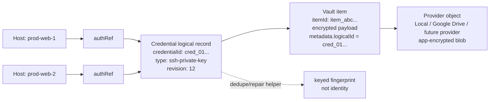
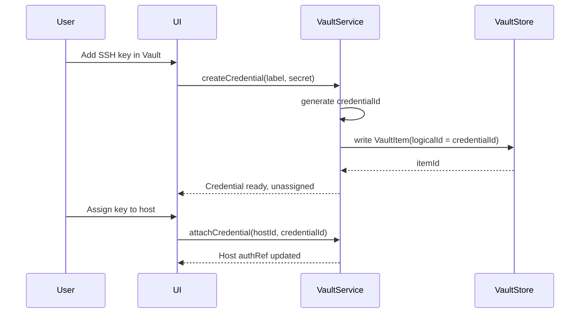
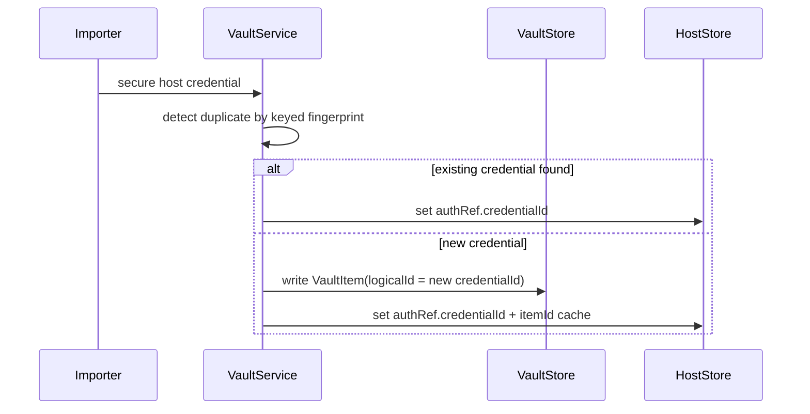
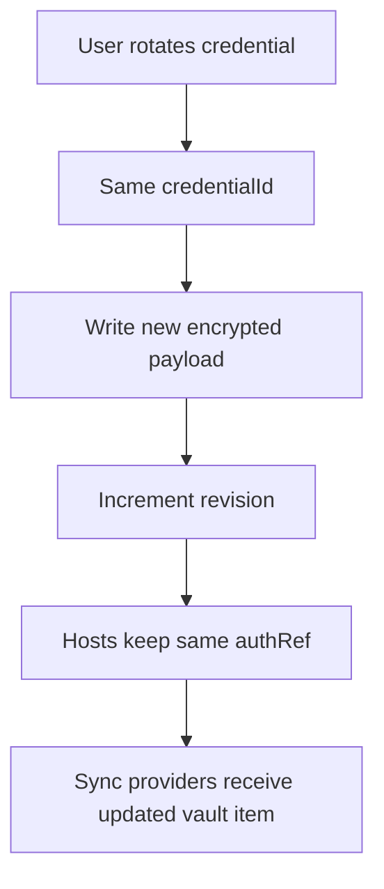
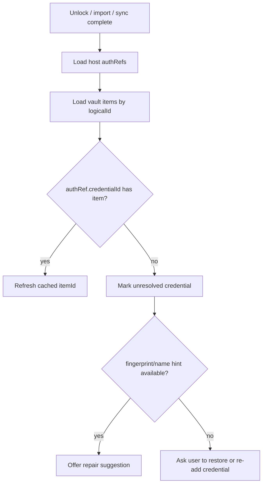

# Vault Credential Identity Model

## Status
- **Owner:** Core app team
- **Document type:** Architecture decision + implementation guide
- **Last updated:** 2026-05-15
- **Scope:** Stable credential identity, host assignment, key-first vault UX, rotation, sync/relink behavior

---

## 1) Decision Summary

Zync should model vault credentials as **first-class objects** that exist independently from hosts.

The durable reference chain is:

```text
Host -> credentialId -> Vault credential record -> encrypted secret
```

Hosts must not own secrets. Hosts should reference a stable credential identity. Vault providers should only store encrypted credential records and sync metadata.

This supports both product flows:

1. **Host-first:** user creates/imports a host with credentials, then Zync stores the credential in the vault and attaches it to the host.
2. **Vault-first:** user adds a key/password to the vault first, then assigns it to one or more hosts later.

### Current implementation status

This document describes the **target durable model**.

Current phase-1 vault work already has:

- encrypted local vault records
- host `authRef` support
- `authRef.credentialId` compatibility field for new vault-backed credentials
- `VaultItem.logicalId` metadata for new vault records
- backend fallback resolution from `credentialId` when a cached `itemId` is stale
- saved-connection repair on load for missing `credentialId` and stale `itemId`
- key-first vault credential creation from the Vault page
- host assignment to existing vault credentials from the connection editor
- optional disconnect prompt for active sessions after assignment/rotation
- Google Drive vault backup/restore
- keyed secret fingerprint for duplicate detection
- migration from plaintext host credentials into vault items

Current phase-1 work does **not yet** fully implement:

- standalone `Credential` records
- rotation history UI and historical revision inspection/restore flow

Until those are implemented, existing `authRef.itemId` behavior remains the compatibility path.
New vault-backed credentials should include both `credentialId` and `itemId`.

---

## 1.1) Remaining planned work: rotation history UI

Rotation currently updates the active vault item in place and increments its revision.
That is enough for stable host references, but it is not yet enough for operator-facing
history, audit, or rollback UX.

### What is still missing

- revision timeline in Vault UI
- per-credential change history view
- optional restore/revert to an older revision
- explicit audit metadata for future team/shared vaults

### Recommended implementation shape

The most maintainable next step is:

1. keep `credentialId` stable
2. treat each rotation as a **new immutable revision snapshot**
3. keep one `currentItemId` fast path for active use
4. expose a revision list in the UI

Recommended shape:

```text
Credential logical record
  -> currentItemId
  -> revisionCounter

Credential revision snapshots
  -> credentialId
  -> revision
  -> itemId
  -> createdAt
  -> rotatedAt
  -> metadata
```

### Why this is better than only mutating in place

- preserves operator-visible history
- supports future rollback
- supports future audit/event stream
- scales better for team vaults and synced environments

### Suggested rollout

1. backend revision snapshot storage
2. read API for revision list
3. Vault UI history drawer/modal
4. optional restore previous revision action

This is intentionally deferred because stable identity + relink + assignment safety are
more important than history UI for the first robust vault foundation.

---

## 2) Why This Model

The old/simple model ties a connection directly to a physical vault item:

```text
Host -> vault item id
```

That is fragile because physical item ids can change after:

- vault reset
- import/export
- cloud restore
- provider migration
- future team-vault migration
- conflict resolution that recreates an item

The robust model separates **logical identity** from **physical storage**:

- `credentialId` is the stable Zync-owned identity.
- `itemId` is the current physical vault record.
- `providerMetadata` is backend/sync detail.
- keyed fingerprint is only a helper for duplicate detection and repair hints.

---

## 3) Core Principles

1. **Hosts reference credentials, not secrets.**
2. **Credential identity is stable across vault profiles and restores.**
3. **Physical vault item ids are replaceable implementation details.**
4. **One credential can be assigned to many hosts.**
5. **Credential rotation updates the credential revision, not every host.**
6. **Fingerprints are helper metadata, never primary identity.**
7. **Deleting vault data cannot recover secrets without a backup/cloud copy.**

### 3.1 Future-proof reference layering (canonical)

For robust long-term behavior (rotation/import/restore/sync), keep a **3-layer identity model**:

1. `credentialId` (logical, stable) — canonical host link target
2. `itemId` (physical vault record) — fast-path cache pointer
3. provider sync metadata (`objectId`/`etag`/`revision`) — transport/sync lineage only

Rules:
- Host auth must resolve from `credentialId` as source-of-truth.
- `itemId` can be relinked/repaired automatically when stale.
- Provider metadata must never become primary host identity.

---

## 4) High-Level Diagram



---

## 5) Domain Model

### 5.1 Credential

Stable logical credential object owned by Zync.

```ts
type Credential = {
  credentialId: string;       // stable logical id, e.g. ULID/UUID
  kind: "ssh-private-key" | "password" | "passphrase" | "token";
  label: string;
  revision: number;           // increments on rotation/change
  currentItemId: string | null;
  currentVaultProfileId: string | null;
  fingerprint: string | null; // keyed HMAC helper, not identity
  createdAt: string;
  updatedAt: string;
  rotatedAt?: string;
};
```

### 5.2 Vault Item

Physical encrypted record in the active vault store/provider.

```ts
type VaultItem = {
  itemId: string;
  logicalId: string;          // same value as Credential.credentialId
  kind: Credential["kind"];
  label: string;
  encryptedPayload: Uint8Array;
  revision: number;
  metadata: {
    fingerprint?: string;
    assignedHostIds?: string[];
    provider?: Record<string, unknown>;
  };
  createdAt: string;
  updatedAt: string;
};
```

### 5.3 Host Auth Reference

Host-side pointer to the credential identity.

```ts
type HostAuthRef = {
  credentialId: string;       // canonical durable reference
  itemId?: string;            // optional fast-path cache
  vaultProfileId?: string;    // optional current scope/profile
  requiredRevision?: number;  // optional pinning for strict flows
};
```

### 5.4 Assignment

Assignments can be implicit on the host or explicit in a join table later.

```ts
type CredentialAssignment = {
  credentialId: string;
  hostId: string;
  purpose: "login" | "sudo" | "tunnel" | "snippet" | "custom";
  createdAt: string;
};
```

---

## 6) Key Workflows

### 6.1 Key-first flow



### 6.2 Host-first migration/import flow



### 6.3 Rotation / key change



Rotation should preserve `credentialId`. Creating an unrelated credential should generate a new `credentialId`.

### 6.4 Relink after import/restore



---

## 7) Identity Rules

### Do

- Generate `credentialId` once when the credential is first created.
- Store `credentialId` in both host auth refs and vault item metadata.
- Preserve `credentialId` during rotation, provider sync, import/export, and local restore.
- Use `itemId` as a cache or provider-local physical pointer.
- Use keyed fingerprint only for duplicate detection and repair suggestions.

### Do Not

- Do not use host id as credential identity.
- Do not use vault item id as long-term identity.
- Do not use raw `SHA-256(secret)` as identity or metadata.
- Do not use keyed fingerprint as the canonical id.
- Do not create duplicate credentials when the same logical credential is restored.

---

## 8) Sync and Provider Behavior

Providers store encrypted objects. They should not decide credential identity.
Provider sync key policy, passphrase choices, and per-provider restore semantics are defined in
[`VAULT_PROVIDER_SYNC_KEY_MODEL.md`](./VAULT_PROVIDER_SYNC_KEY_MODEL.md).

Provider records should include encrypted payload plus safe metadata:

```ts
type ProviderVaultObject = {
  objectPath: string;
  encryptedBlob: Uint8Array;
  metadata: {
    logicalId: string;
    kind: string;
    revision: number;
    updatedAt: string;
    etag?: string;
  };
};
```

Sync conflict rules:

- Same `logicalId`, higher revision: candidate update.
- Same `logicalId`, divergent same revision: conflict.
- Same keyed fingerprint, different `logicalId`: duplicate warning, not automatic merge.
- Missing physical `itemId`, present `logicalId`: relink if matching vault item exists.
- Remote per-provider records use `logicalId` / `credentialId` as stable identity so credentials
  can be restored into a new local vault without preserving old physical `itemId`s.

---

## 9) UX Implications

### Vault page

Show credentials as first-class items:

- label
- type
- assigned hosts count
- last used / rotated
- sync state
- duplicate warning if fingerprint matches another credential

### Host editor

Auth section should support:

- select existing vault credential
- create new vault credential
- detach credential
- rotate selected credential
- show unresolved credential warning

### Broken reference state

If a host has `credentialId` but no matching vault item:

```text
This host references a missing vault credential.
Restore a vault backup, reconnect cloud sync, re-add the key, or remove the reference.
```

Possible actions:

- Restore vault
- Relink to existing credential
- Add replacement key
- Remove broken reference

---

## 10) Migration Plan From Current AuthRefs

### Phase 1 — Add fields without breaking old records

- Extend host `authRef` with `credentialId`.
- Extend vault item metadata with `logicalId`.
- Keep existing `itemId` reads working.

### Phase 2 — Backfill

For each existing host:

1. If it has a vault item and no `credentialId`, generate one.
2. Write `logicalId` into vault item metadata.
3. Write `credentialId` into host authRef.
4. Keep `itemId` as cache.

### Phase 3 — Key-first UX

- Add “Add credential” in Vault.
- Allow unassigned credentials.
- Add assignment flow in host editor.

### Phase 4 — Repair tooling

- Detect stale auth refs.
- Auto-relink by `credentialId`.
- Suggest repair by keyed fingerprint only when unambiguous.

---

## 11) Security Notes

- The secret payload remains encrypted in the vault.
- `credentialId` is not secret.
- `itemId` is not secret.
- keyed fingerprint is sensitive metadata and should only be derived with vault-held key material.
- Raw secret hashes must never be exposed to UI/provider metadata.
- If both vault data and cloud/export backups are gone, Zync cannot recover deleted secrets.

---

## 12) Acceptance Criteria

The model is considered implemented when:

- A credential can be created without a host.
- Multiple hosts can reference one credential.
- Rotating a credential does not require editing each host.
- Import/export preserves `credentialId`.
- Sync restore can relink hosts by `credentialId`.
- Missing credentials show explicit repair UX.
- Duplicate detection uses keyed fingerprint as helper only.
- Existing item-id-only auth refs migrate forward without breaking current connections.
